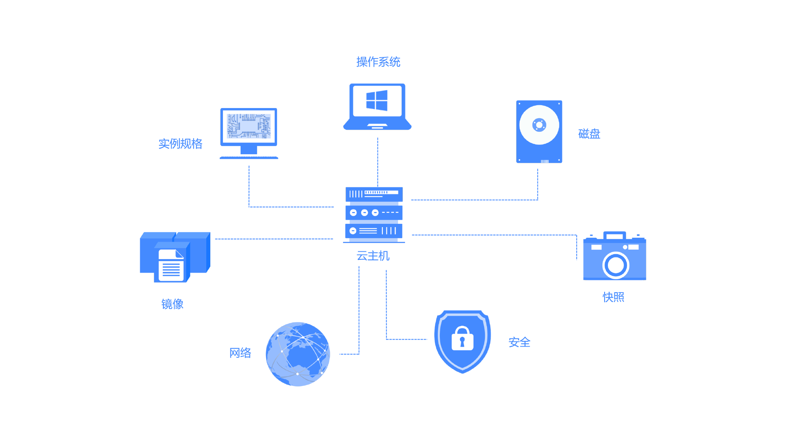

# 概述
云主机（Virtual Machines,VM）是京东云提供的一种基础计算服务单元，提供处理能力可弹性伸缩的计算服务。云主机涉及多种概念，如下图所示，包括实例规格（vCPU及内存）、操作系统、磁盘、网络、安全等，每种资源都提供多种配置选项，您可以根据实际需要进行选择。

云主机管理方式比物理服务器更简单高效，您可根据实际需要对这些资源进行灵活的组合，您可通过控制台、OpenAPI或CLI随时创建指定数量的云主机，在使用过程中可以根据业务规模随时调整实例规格，对于过剩或闲置的资源也可以进行释放以便节约投入成本。京东云云主机为您快速部署应用提供稳定可靠的基础能力，使您更专注于核心业务创新。

## 相关概念
了解京东云云主机时，通常会涉及到的概念请参见[核心概念](Core-Concepts.md)。
## 相关服务
* 您可以从云市场获取由第三方服务商提供的基础软件、企业软件、网站建设、代运维、云安全、数据及API、解决方案等相关的各类软件和服务。您也可以成为云市场服务商。详细信息请参见云市场文档。
* 您可以使用负载均衡将业务流量自动分发至多个后端实例。详细信息请参见[负载均衡产品文档](../../../Networking/Load-Balancer/Introduction/Product-Overview.md)。
* 您可以使用云监控对您实例、存储、网络进行实时监控并设置异常报警。详细信息请参见[云监控产品文档](../../../Management/Monitoring/Introduction/Product-Overview.md)。
* 您可以使用容器服务管理部署在一组云主机的应用生命周期。详细信息请参见[容器服务产品文档](../../Native-Container/Introduction/Product-Overview.md)。
* 您可以使用云主机搭建数据库服务，也可以使用京东云云数据库服务。详细信息请参见[云数据库](../../../Database-and-Cache-Service/RDS/Introduction/Product-Overview.md)。
* 您可以编写代码调用京东云OpenAPI服务访问京东云的产品和服务。详细信息请参见[OpenAPI](https://docs.jdcloud.com/virtual-machines/api/overview)。

## 使用云主机
京东云提供Web操作界面，即控制台，您可以使用京东云账号直接登录[云主机控制台](https://cns-console.jdcloud.com/compute/list)，对您的云主机进行管理及操作。

京东云也提供了API接口方便您管理云主机，有关云主机API操作的详细信息，请参见[OpenAPI文档](https://docs.jdcloud.com/cn/virtual-machines/api/overview)。您可以使用SDK（支持 Java/Python/Go/Node.js/PHP/.Net/C++）编程或使用京东云云命令行工具（CLI）调用云主机API，具体请参考：[SDK文档](https://docs.jdcloud.com?act=3)及[CLI文档](https://docs.jdcloud.com/cn/cli/introduction)。

## 计费说明
云主机支持包年包月和按配置两种计费模式：

* 包年包月：可选1至9个月的包月服务，或1至3年的包年服务，价格较按配置计费更低。采用预付费方式，请您购买后留意云主机到期时间并及时续费或开启自动续费功能。
* 按配置：根据您的实例配置及对应实际使用时长，每小时扣费，精确至秒，您只需在购买前预先向账户充值保证余额充足即可。

具体内容，请参见[计费规则](../Pricing/Billing-Rules.md)。 

