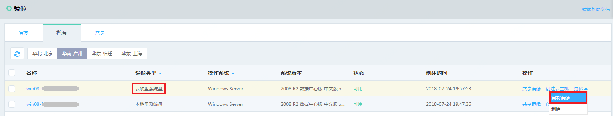
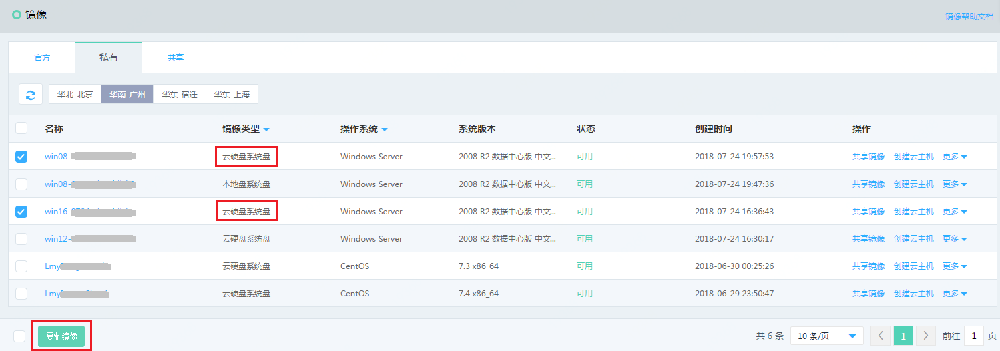
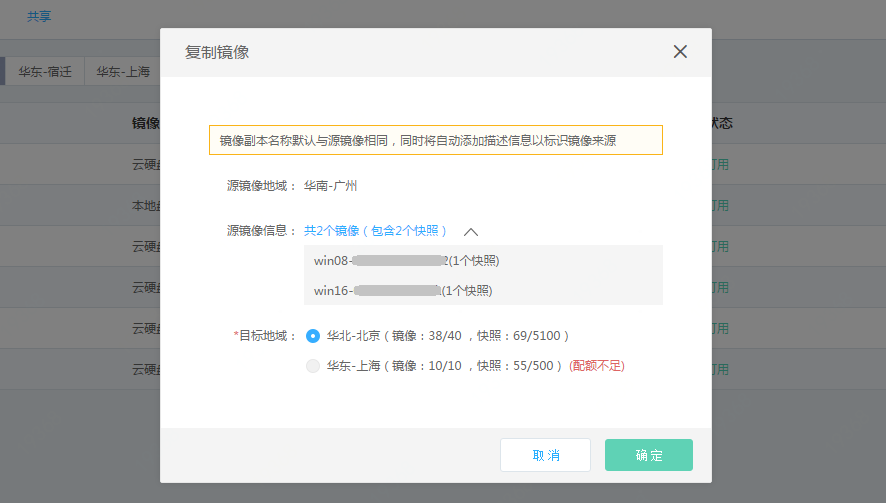
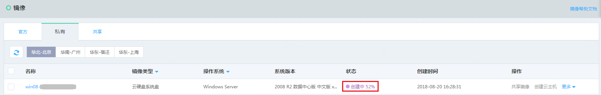
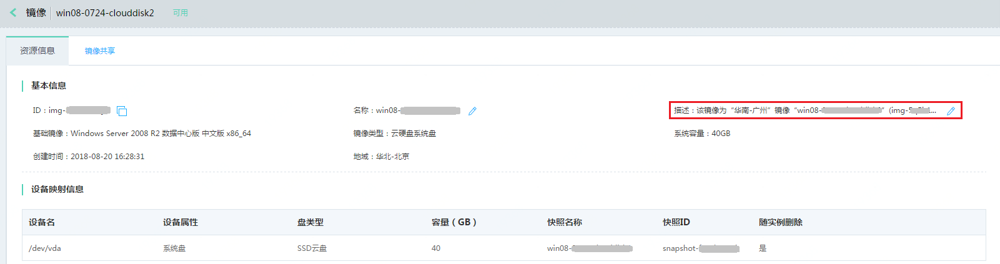

# 复制镜像
当您需要基于私有镜像进行跨地域一致性部署业务时，可以通过镜像复制功能，将某一地域下的一个或多个镜像复制到指定的其他地域。复制完成的时间取决于镜像大小、网络传输速度及系统并发任务处理情况。

镜像复制操作会先对镜像引用的云硬盘快照进行复制，随后补充相关引用关系及镜像元数据，生成副本镜像。

## 前提条件
* 仅镜像类型为“云硬盘系统盘”且状态为“可用”的私有镜像支持复制操作，“本地盘系统盘”私有镜像若需复制请先通过[镜像类型转换](../Operation-Guide/Image/Convert-Image.md)转换为“云硬盘系统盘”镜像后，再操作复制。
* 由于复制操作会占用目标地域下私有镜像和云硬盘快照的配额，因此请在操作前确保目标地域下相应的配额充足。

## 注意事项
* 复制镜像支持批量操作，单次操作最多支持复制5个镜像；
* 目标地域仅可选择除当前镜像所在地域外的其他地域，且单次仅可选择一个地域；
* 为了标识副本镜像的来源，复制操作生成的镜像名称默认与源镜像相同，同时会在描述中自动添加源镜像信息（源镜像地域及ID）；
* 复制操作不会改变源镜像的状态，但在复制操作完成前，源镜像不可删除，不可再次提交复制请求，其余操作（查看、修改信息、创建云主机实例等）不受影响。

## 操作步骤
1. 访问[镜像控制台][1]，即进入镜像列表页面。或访问[京东云控制台][2]点击左侧导航栏【弹性计算】-【云主机】-【镜像】进入镜像列表页。
2. 选择【私有镜像】TAB，选择需要复制的私有镜像(镜像类型须为云硬盘系统盘)，点击【更多】-【复制镜像】；或批量勾选不多于5个镜像，点击列表下方的【复制镜像】。

3. 在确认弹窗中会显示所选源镜像镜像包含的快照数量，以及除当前地域外其他支持复制操作的地域下私有镜像及云硬盘快照的配额用量。点击【确定】，开始镜像复制任务。

4. 复制任务提交成功后，副本镜像会显示“创建中”状态，同时以百分比的形式显示整体复制进度。副本镜像名称与源镜像相同，自动添加描述自段，可创建完成后自行修改。
 
 
 
 
 
 ## 相关参考
 
[镜像类型转换](../Operation-Guide/Image/Convert-Image.md)

  [1]: https://cns-console.jdcloud.com/host/image/list