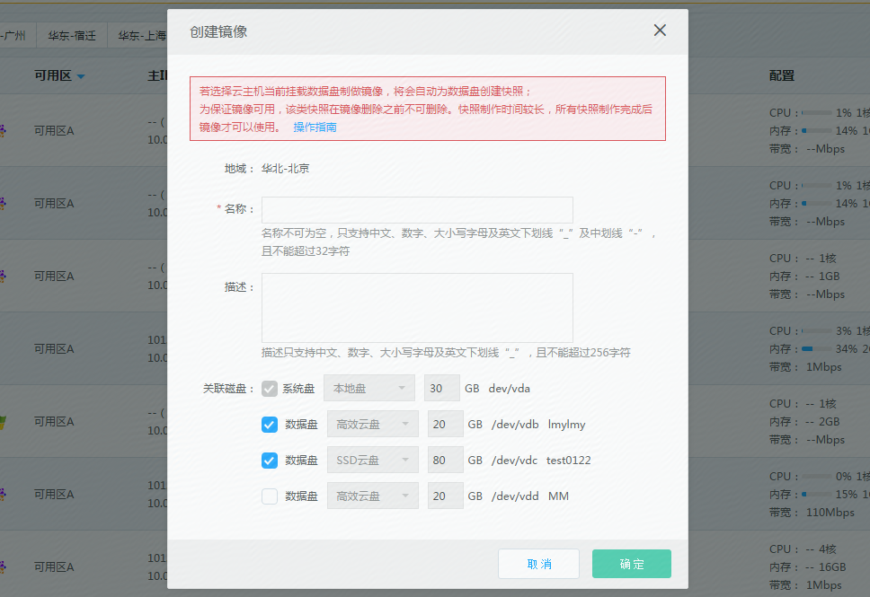
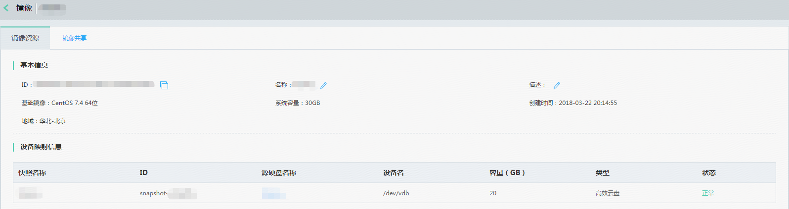
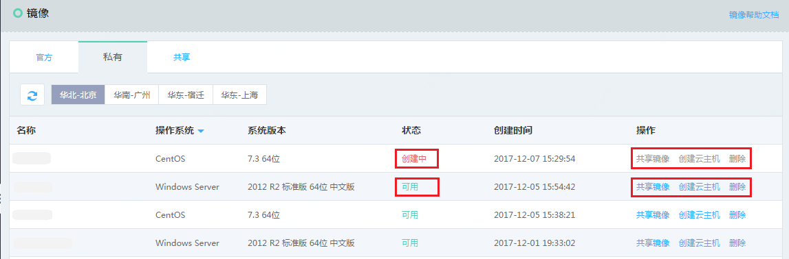

# 基于实例创建私有镜像
您可以根据需要，通过已经创建的实例创建私有镜像，并使用这个镜像启动更多与原实例具有相同操作系统、预装的软件以及相关配置的实例。

## 前提条件
* 为保证数据完整性，仅支持对“已停止”状态的实例制作私有镜像。
* 若实例系统盘为云硬盘或实例挂载了数据盘，则除私有镜像配额外，还需要占用云硬盘快照配额，因此请在操作前确保镜像和云硬盘快照配额充足。

## 注意事项
* 对于Linux系统，若该实例在/etc/fstab内配置了自动挂载命令，制作私有镜像前还请删除相关自动挂载命令，否则基于其私有镜像创建的实例可能无法正常启动。
* 若当前实例系统盘为本地盘，则创建完成后的私有镜像为本地盘系统盘镜像；若当前实例系统盘为云硬盘，则创建完成后的私有镜像为云硬盘系统盘镜像。您可以通过[镜像类型转换](Convert-Image.md)将本地盘系统盘镜像转换为云硬盘系统盘镜像。

## 操作步骤
1. 访问[云主机控制台][1]，即进入实例列表页面。或访问[京东云控制台][2]点击左侧导航栏【弹性计算】-【云主机】-【实例】进入实例列表页。
2. 选择要创建私有镜像的实例，点击【更多】-【制作镜像】。

3. 在创建镜像的弹窗中，完成对私有镜像“名称”、“描述”的补充，点击【确定】，开始私有镜像创建。
4. 制作镜像除了备份系统盘以外，您可以选择一同备份实例当前挂载的数据盘，数据盘将以快照的形式与系统盘镜像进行关联，并显示在私有镜像详情页中的“设备映射信息”中，作为后续使用该私有镜像创建实例时数据盘的预设配置，方便快速整机部署。如果您希望对数据盘的容量进行修改可在基于该镜像创建主机时调整。点此详见数据盘[设备名分配规则](../Operation-Guide/Cloud-Disk/Assign-Device-Name.md)。
5. 制作整机镜像耗时较长，为避免制作失败，请在制作过程中停止对主机和云硬盘的其他操作，同时请确保您当前实例和云硬盘快照的配额充足。

6. 提交的私有镜像，经过“创建中”，“复制中”两个中间状态，最终创建完成，变为“可用”状态，可以正常使用。中间状态，不可对镜像进行【共享】，【创建云主机】，【删除】操作。

7. 制作镜像过程中，任一资源创建失败均会导致镜像为“错误”状态，如选择了主机挂载的数据盘制作整机镜像，则操作失败会自动删除此次操作创建的所有快照，私有镜像需要您自行确认后删除。

 
 ## 相关参考
 
[镜像类型转换](Convert-Image.md)
 
[设备名分配规则](../Operation-Guide/Cloud-Disk/Assign-Device-Name.md)

  [1]: https://cns-console.jdcloud.com/
  [2]: https://console.jdcloud.com/
  [3]: ./images/Operation-Guide-Image-create1.png "Operation-Guide-Image-create1.png"
  [4]: ./images/Operation-Guide-Image-create2.png "Operation-Guide-Image-create2.png"
  [5]: ./images/Operation-Guide-Image-create3.png "Operation-Guide-Image-create3.png"
  [6]: ./images/Operation-Guide-Image-create4.png "Operation-Guide-Image-create4.png"