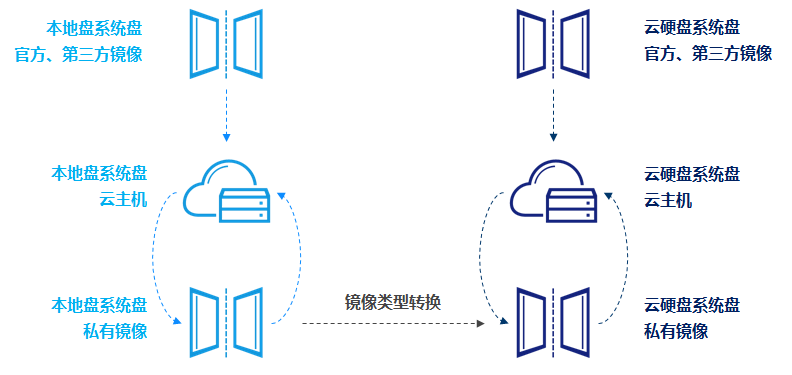

# 镜像类型
从镜像的架构模式来分类，镜像可分为本地盘系统盘镜像和云硬盘系统盘镜像两种类型；
从镜像的来源及使用权限分类，镜像可分为官方镜像、私有镜像、共享镜像和云市场镜像四种类型。
## 架构模式分类
官方镜像、云市场镜像均同时提供两种架构模式的镜像，私有镜像的架构取决于制作镜像使用的云主机的系统盘类型（本地盘还是云硬盘）。 
在使用镜像创建云主机，及基于云主机创建私有镜像的过程中，镜像的架构模式是继承并不可更改的，若希望基于已有的本地盘系统盘镜像创建云硬盘系统盘云主机，可以通过[镜像类型转换](/Convert-Image.md)基于本地盘系统盘镜像生成一个云硬盘系统盘镜像，然后再进行云主机创建。

### 本地盘系统盘镜像
本地盘系统盘镜像仅可用于创建系统盘为本地盘的云主机，其设备映射信息中/dev/vda 引用了本地系统盘镜像文件，其余设备信息均引用数据盘快照文件。
### 云硬盘系统盘镜像
云硬盘系统盘镜像仅可用于创建系统盘为云硬盘的云主机，其设备映射信息中/dev/vda 引用了云硬盘系统盘快照文件，其余设备信息均引用数据盘快照文件。

## 来源及使用权限分类
### 官方镜像
官方镜像是由京东云提供和维护的公共镜像，基于上游官方发行厂商提供Linux和Windows的多个发行版本（Windows镜像目前免费提供正版License）提供基础操作系统、初始化组件及部分预装软件，所有用户均可以使用。
### 私有镜像
私有镜像是基于您的自有实例创建自定义镜像，您可以为已部署业务的实例制作镜像，基于此镜像快速创建多个具有相同配置和软件环境的实例。您可以将私有镜像共享给同其他京东云用户，被共享镜像会显示在目标用户同区域的共享镜像列表中。私有镜像支持删除和基本信息修改。
### 共享镜像
共享镜像是由其他京东云用户通过镜像共享功能将其自定义镜像共享至您使用的一类镜像。共享镜像仅可用于创建实例，不可进行基本信息修改、删除等操作，若发起共享的用户操作取消共享，则该镜像会从您的共享镜像列表中自动删除。
### 镜像市场镜像
镜像市场镜像是由入驻云市场的服务商所提供的镜像，集成了针对不同业务场景的运行环境或软件，方便用户快速部署业务。
## 官方镜像发行版本
|   **操作系统**  |  **系统版本**   |
| :--- | :--- |
|   Windows Server  |  2016 数据中心版 中文版 2012 R2 标准版 中文版 2008 R2 数据中心版 中文版|
|  CentOS   |  7.4、7.3、7.2、7.1、7.2  NAT Gateway 6.9、6.8、6.6、6.5   |
|   Ubuntu  |  16.04、14.04   |

**注：京东云目前提供的官方镜像均为64位镜像**
## 镜像使用限制
官方镜像：所有用户均可以使用。

私有镜像：仅创建者和共享对象可以使用，用户每个地域下可以创建不多于5个私有镜像；用户可以将一个镜像分享给不多于5个京东云用户。

共享镜像：仅创建者和共享对象可以使用，用户每个地域下可以接受不多于5个共享镜像。

镜像市场镜像：所有用户均可以使用。可通过控制台或云市场选择镜像创建主机，也可通过[重置系统](../Instance/Rebuild-Instance.md)更换镜像为镜像市场镜像。

## 相关参考

[镜像类型转换](/Convert-Image.md)

[重置系统](../Instance/Rebuild-Instance.md)
