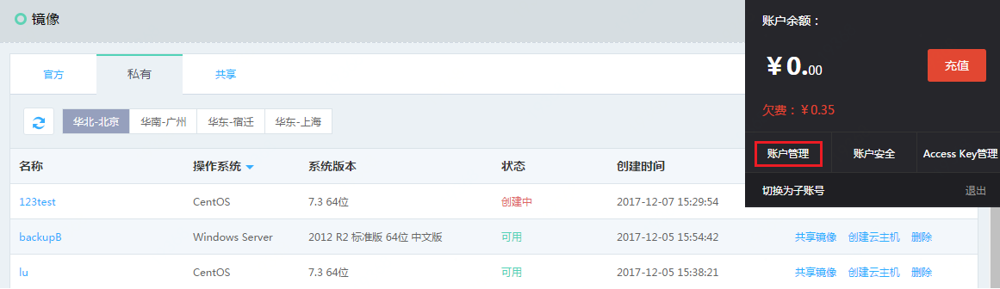
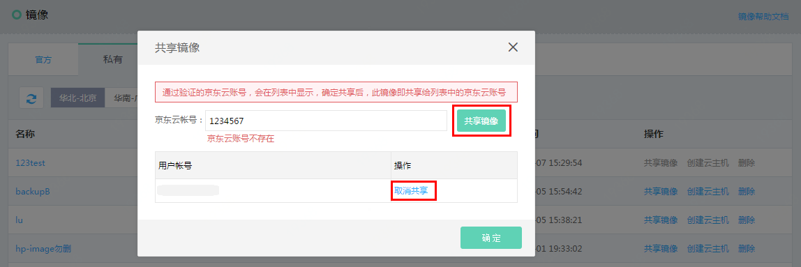

# 共享私有镜像
共享镜像是将您已经创建好的私有镜像共享给其他京东云用户使用的私有镜像。您可以方便地从其他用户那里获得镜像使用权限，并从中获得需要的组件及添加自定义内容，也可以将自己创建的私有镜像通过“镜像共享”功能，共享给其他京东云账号。
只有镜像的拥有者才有权限共享镜像，被共享者无法将共享镜像再次共享给其他京东云用户。
需要注意的是，京东云无法保证其他用户共享给您的镜像的完整性以及安全性，我们建议您只使用来自可靠来源的共享镜像。

## 前提条件
* 仅“可用“状态的私有镜像支持共享；
* “镜像共享”功能，只能共享至对方的京东云账号，不支持使用账号绑定手机号进行共享，请通过如下方式，获取正确的京东云账号信息：
    * 点击右上角的用户账号，选择【账户管理】进入用户中心。
    * 在“基本资料”中查看基本信息，“用户Pin”即为正确的用户账号。

## 操作步骤

1. 访问[镜像控制台][2]，或访问[京东云控制台](https://console.jdcloud.com/overview)点击左侧导航栏【弹性计算】-【云主机】-【镜像】进入镜像列表页。

2. 选择【私有】TAB，在列表中选定您要共享的私有镜像。

3. 您可以在列表操作列点击【共享镜像】操作，也可以进入镜像详情页，在【镜像共享】TAB下点击【添加共享】。

4. 在共享镜像弹框中，输入共享对象的京东云账号，点击【共享镜像】按钮，账户验证成功则完成共享，验证失败会提示您“京东云账号不存在”。

5. 已经共享的账号会在下方列表中展示，可在此直接进行【取消共享】操作。

**请注意：引用了快照的私有镜像暂不支持共享。**

  [1]: ./images/Operation-Guide-Image-share1.png "Operation-Guide-Image-share1.png"
  [2]: https://cns-console.jdcloud.com/host/image/list
 