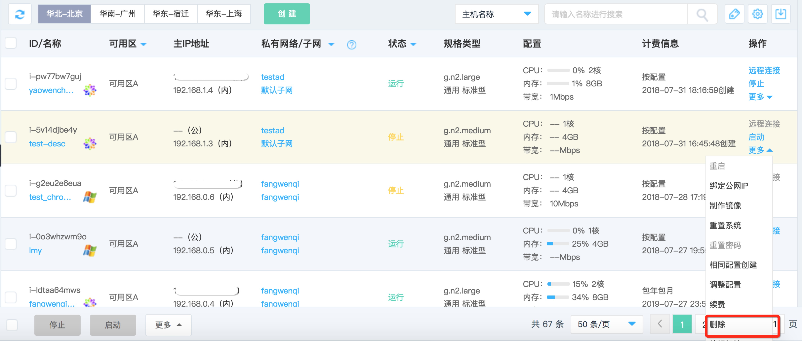
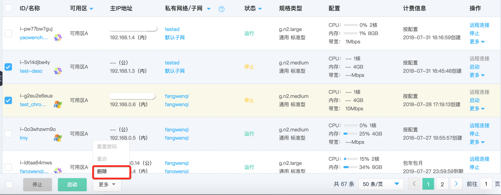

# 删除实例

如果您由于业务变动不再需要这些实例了，您可以操作删除实例以节约费用。

## 前提条件

* 实例须处于“已停止”状态。若实例处于“运行中”状态，请先操作[停止实例](Stop-Instance.md)；若实例处于其他非稳定状态，还请等待前序操作执行完成后再操作删除实例。
* 对于包年包月实例，到期前不允许删除，到期后才允许删除；
	
		请注意：
		* 实例删除后所有数据将被清除且不可恢复，请提前备份数据，详细请查阅实例制作私有镜像、创建云硬盘快照；
		* 实例删除时，所挂载云硬盘将根据配置的删除属性执行；所绑定弹性公网IP将继续保留，如不需保留，请前往对应页面删除，以免产生额外费用。

## 操作步骤
1. 访问[云主机控制台](https://cns-console.jdcloud.com/host/compute/list)，即进入实例列表页面。或访问[京东云控制台](https://console.jdcloud.com)点击左侧导航栏【弹性计算】-【云主机】进入实例列表页。
2. 选择地域。
3. 在实例列表中选择需要删除的实例，确认其状态为“已停止”。如果需要同时操作多台实例，可通过多选实现。
4. 单台操作：点击【操作】-【更多】-【删除】按钮，或点击实例名称进入详情页后点击【操作】-【删除】按钮
 批量操作：点击列表下方【更多】-【删除】按钮

5. 在弹出的“删除实例”弹窗中，确认信息，点击【确定】提交删除。

之后实例将进入删除中状态，请您耐心等待删除完成。

## 相关参考

[停止实例](Stop-Instance.md)

[制作私有镜像](http://docs.jdcloud.com/cn/virtual-machines/create-private-image)

[创建云硬盘快照](http://docs.jdcloud.com/cn/cloud-disk-service/create-clouddisk-snapshot)
