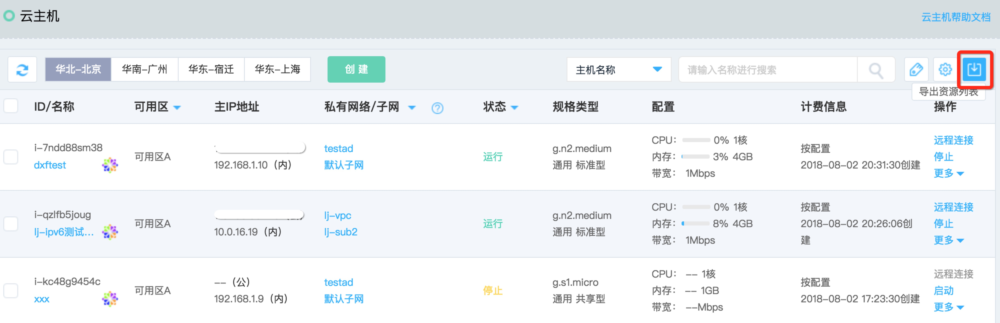

# 导出实例信息

您可通过控制台导出指定地域下的实例列表。当前支持导出的信息有：ID、名称、地域、可用区、高可用组、故障域、状态、镜像、实例规格、主内网IP、主内网IP所绑定公网IP及带宽、私有网络、子网、所绑定云硬盘、计费信息、标签、创建时间及到期时间（对于包年包月计费云主机）。

## 操作步骤

1. 访问[云主机控制台](https://cns-console.jdcloud.com/host/compute/list)，即进入实例列表页面。或访问[京东云控制台](https://console.jdcloud.com)点击左侧导航栏【弹性计算】-【云主机】进入实例列表页。
2. 选择地域。
3. 点击实例列表页右上角点击导出列表icon。  
	
		请注意：导出时间受实例项数影响，若数据较多时还请耐心等待。
	