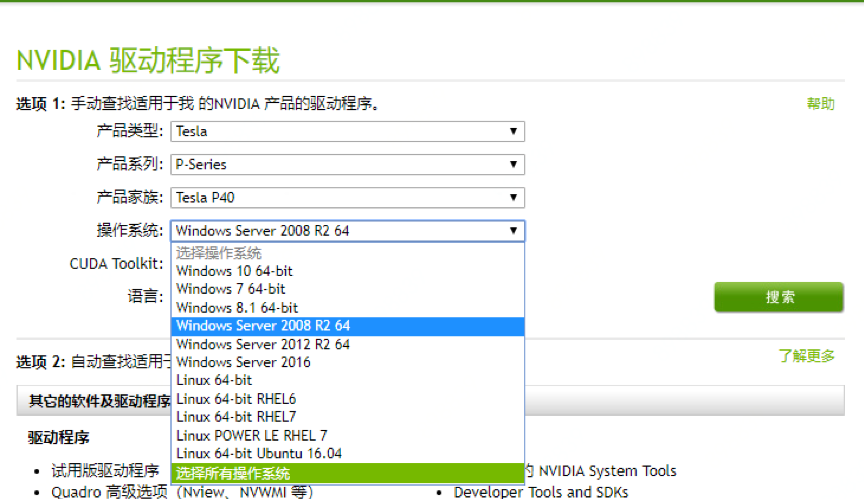
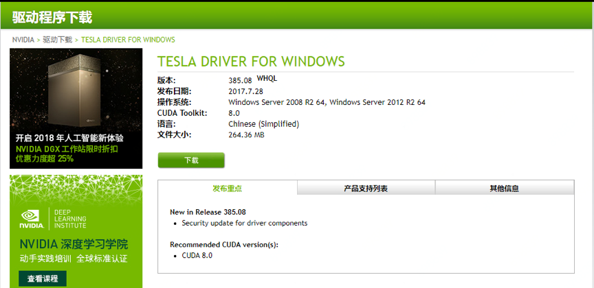
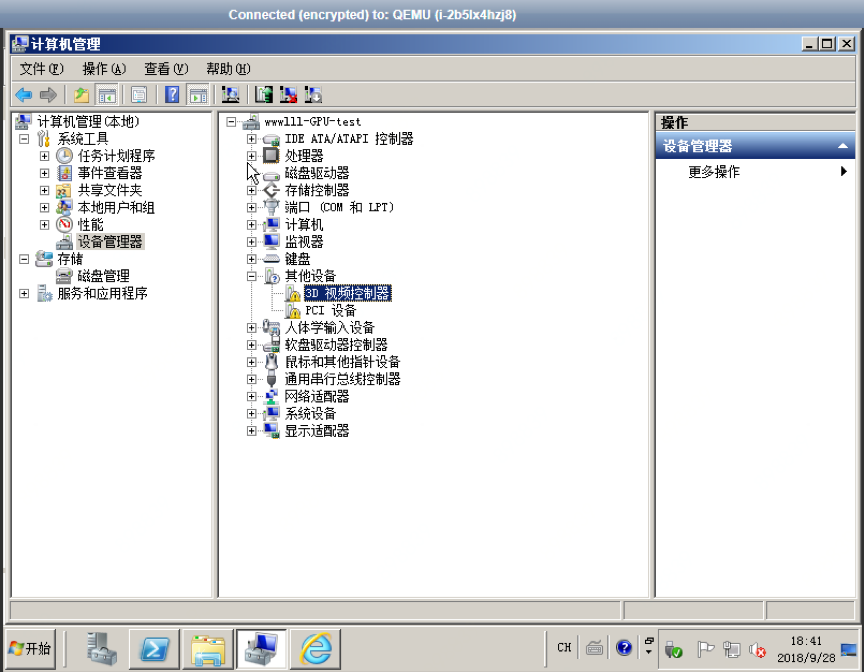
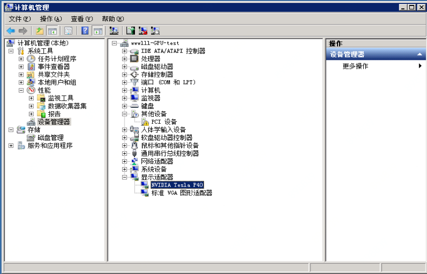
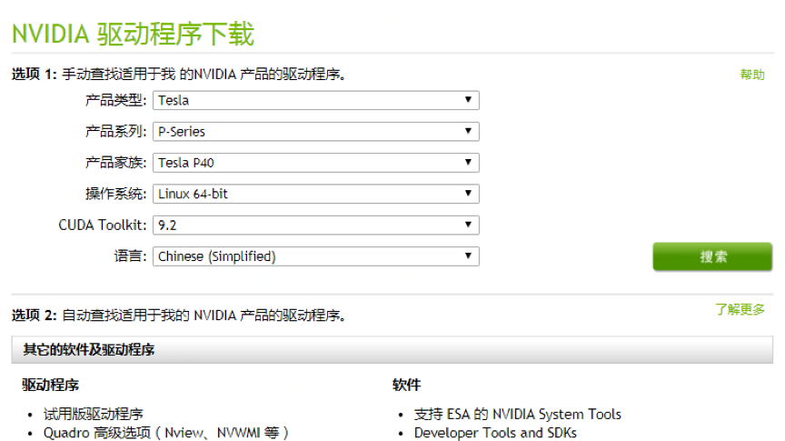
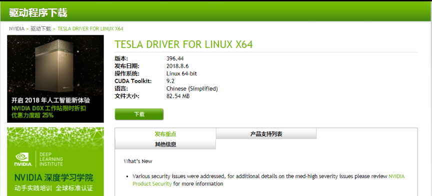
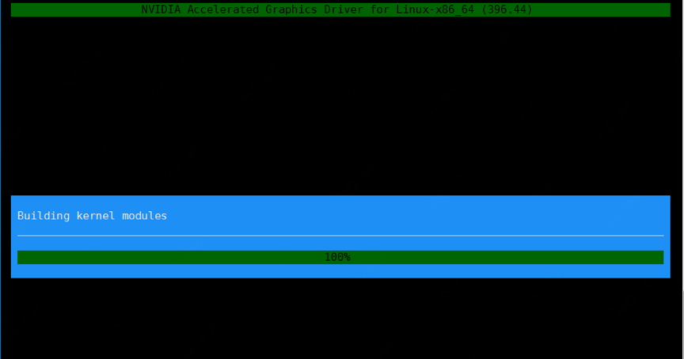
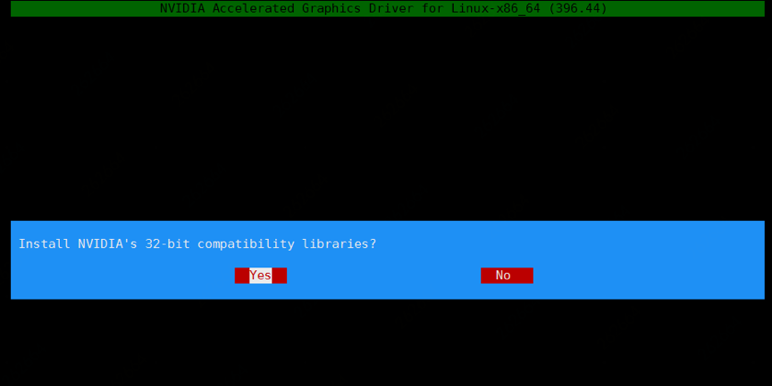
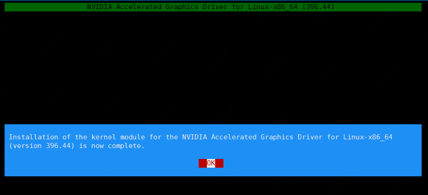
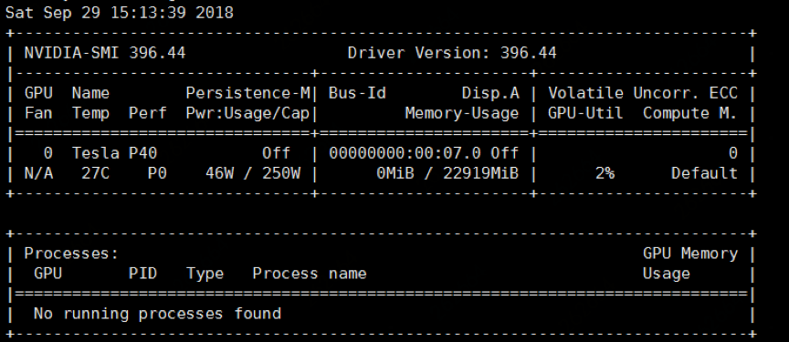

# GPU云主机


## 下载并安装GPU驱动

### Windows系统

以Windows 2008 R2 数据中心版为例，安装GPU驱动步骤如下：

* 获取GPU驱动安装包：
	* 进入[NVIDIA官网](https://www.nvidia.com/Download/Find.aspx)；
	* 手动查找适用于实例的驱动程序，并单击【搜索】。筛选信息说明如下图所示。<br>
	* 确认无误后，单击【下载】按钮，下图是Windows Server 2008 R2的驱动截图。<br>
* 安装GPU驱动：
	* Windows系统直接双击安装GPU驱动。
* GPU驱动验证
	* 安装GPU驱动之前，设备管理器中的显卡信息是“3D 视频控制器”，如下图所示<br>
	* GPU显卡驱动成功安装后，显卡将在“显示适配器”折叠项中显示，如下图所示<br>

### Linux系统

以CentOS7.4为例，安装GPU驱动步骤如下：

* 获取GPU驱动安装包：
	* 进入[NVIDIA官网](https://www.nvidia.com/Download/Find.aspx)；
	* 手动查找适用于实例的驱动程序，并单击【搜索】。筛选信息说明如下图所示。<br>
	* 确认无误后，单击【下载】按钮，下图是CentOS7.4的驱动截图。<br>
	* 在centos7.4中也可以通过以下命令直接下载上述驱动，其中下载链接可在上图中右键点击下载按钮获取：
	
`wget http://cn.download.nvidia.com/tesla/396.44/NVIDIA-Linux-x86_64-396.44.run`
	
* 安装GPU驱动：
	* 下载并安装kernel对应版本的kernel-devel和kernel-header包:
		* 通过 ”uname -r” 命令查看centos7.4中的kernel版本为：3.10.0-693.17.1.el7.x86_64
		* 对应的Kernel-devel下载地址：http://vault.centos.org/7.4.1708/updates/x86_64/Packages/kernel-devel-3.10.0-693.17.1.el7.x86_64.rpm
		* 对应的kernel-header下载地址:http://vault.centos.org/7.4.1708/updates/x86_64/Packages/kernel-headers-3.10.0-693.17.1.el7.x86_64.rpm
		* 通过wget命令下载上面两个包，然后通过yum install安装。
		* 需要特别注意下载的kernel-devel，kernel-header版本要与当前运行的kernel版本完全一致，否则gpu驱动无法正常安装使用。
安装完成后，如下所示 -：
```
	# uname –r
	3.10.0-693.17.1.el7.x86_6
	# rpm -qa | grep 693.17.1
	kernel-devel-3.10.0-693.17.1.el7.x86_64
	kernel-headers-3.10.0-693.17.1.el7.x86_64
	kernel-3.10.0-693.17.1.el7.x86_64
```

* 安装下载的gpu驱动
```	
	# Chmod +x NVIDIA-Linux-x86_64-396.44.run
	# ./ NVIDIA-Linux-x86_64-396.44.run
```
正确安装过程如下所示：<br><br><br><br>
* GPU驱动验证
	* 安装完成后，执行：nvidia-smi，显示如下图所示，说明安装成功。
	
