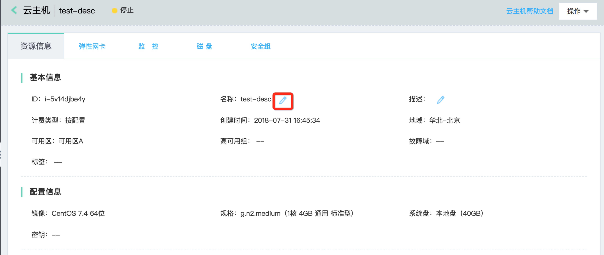
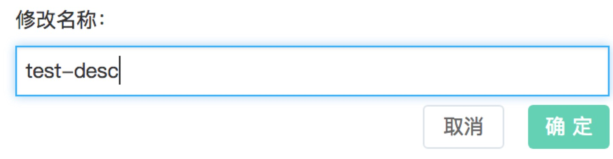

# 修改实例名称

您可根据需要修改您实例名称。

## 操作步骤
1. 访问[云主机控制台](https://cns-console.jdcloud.com/host/compute/list)，即进入实例列表页面。或访问[京东云控制台](https://console.jdcloud.com)点击左侧导航栏【弹性计算】-【云主机】进入实例列表页。
2. 选择地域。
3. 在实例列表中选择需要修改名称的实例，点击实例名称进入详情页。
4. 点击【资源信息】-【基本信息】-【名称】右侧修改icon。
5. 在弹出的“修改名称”弹窗中，按需输入新实例名称，点击【确定】提交修改。

