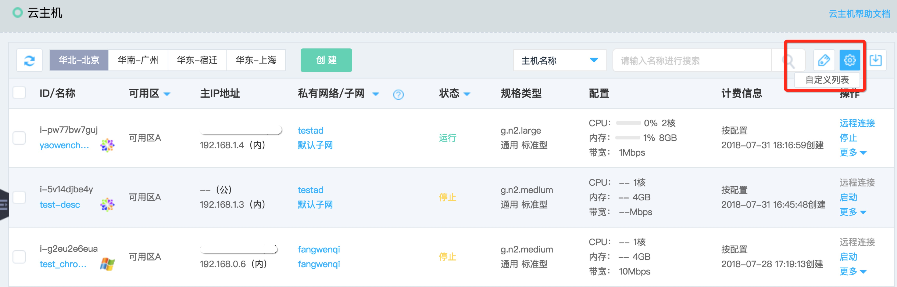
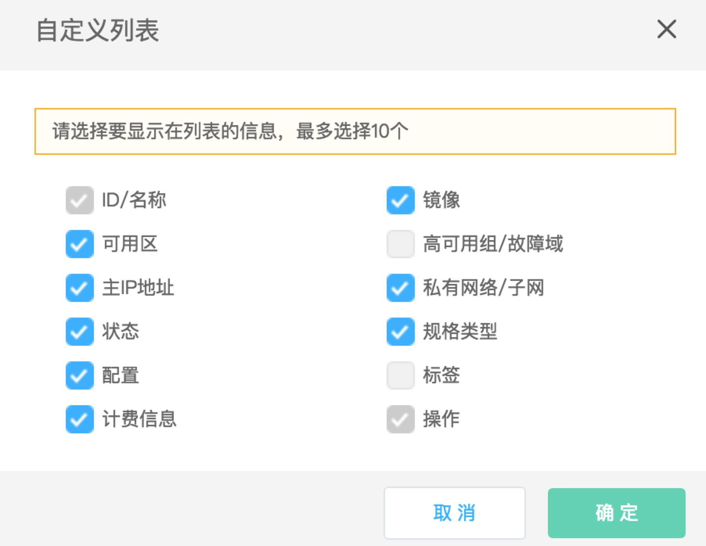

# 查看实例

您可通过控制台查看您所拥有的实例：

* [概览页](Query-Instance-Info#user-content-1)：可查看当前账号下各地域实例数及配额情况。
* [实例列表页](Query-Instance-Info#user-content-2)：可以查看各地域下所有实例的信息，包括ID、名称、可用区、IP地址等。
* [实例详情页](Query-Instance-Info#user-content-3)：可以查看指定实例的详细信息。

## 概览页

[概览页](https://console.jdcloud.com)即为您登录京东云控制台的默认首页。可查看当前账号下各地域实例数及配额情况。

	
	

## 实例列表页

1. 访问[云主机控制台](https://cns-console.jdcloud.com/host/compute/list)，即进入实例列表页面。或访问[京东云控制台](https://console.jdcloud.com)点击左侧导航栏【弹性计算】-【云主机】进入实例列表页。
2. 选择地域。

	您可查看选定地域下所有实例的信息，包括ID、名称、可用区、IP地址等。由于实例信息项较多，您可按需通过自定义列表调整在实例列表页显示的信息项，详细操作步骤如下：

3. 点击实例列表页右上角自定义列表icon 

4. 在弹出的自定义列表弹窗中勾选您需要显示的信息项，点击【确认】。

		请注意：当前列表至多支持显示10项信息项。
		
您还可以从实例列表页跳转至实例所在私有网络、所在子网、所在高可用组等详情页面查看相关信息。

	
## 实例详情页

1. 访问[云主机控制台](https://cns-console.jdcloud.com/host/compute/list)，即进入实例列表页面。或访问[京东云控制台](https://console.jdcloud.com)点击左侧导航栏【弹性计算】-【云主机】进入实例列表页。
2. 选择地域。
3. 在实例列表中选择需要查看详细信息的实例，点击实例名称进入详情页。

您可查看以下实例信息：

* 基本信息：ID、名称、描述、计费类型、创建时间、过期时间（包年包月计费类型）、地域、可用区、高可用组、故障域、标签
* 配置信息：镜像、规格、系统盘、密钥
* 网络信息：私有网络、子网、内网IP、公网IP

您还可以从实例详情页跳转至实例所在私有网络、所在子网、所在高可用组、实例绑定云硬盘、实例绑定弹性网卡、实例绑定安全组、实例监控报警等详情页面查看相关信息。
