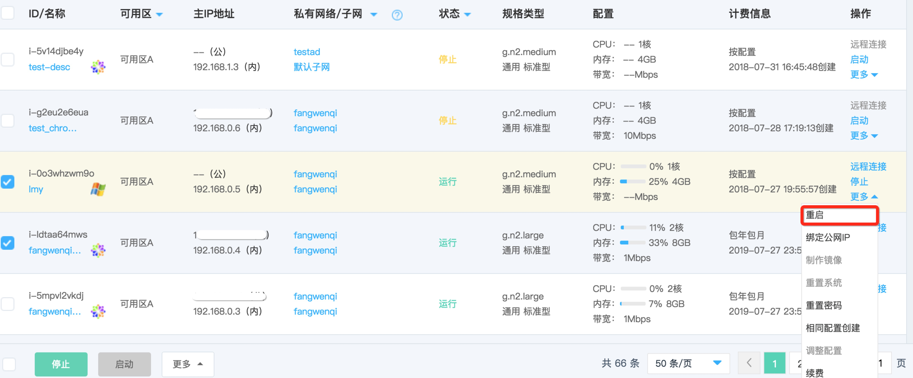
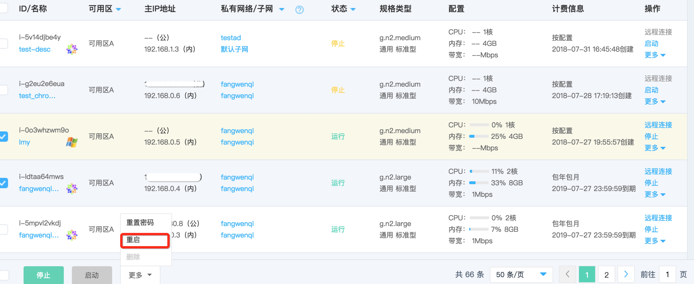

# 重启实例

如果您实例出现无法恢复的故障需要重启实例时，您可操作重启实例。

## 前提条件

实例必须处于“运行中”状态。若实例处于“已停止”状态，则您只需[启动实例](Start-Instance.md)；若实例处于其他非稳定状态，还请等待前序操作执行完成后再操作重启。
	
	请注意：
	* 重启操作会造成您业务中断，还请谨慎操作；
	* 触发重启操作后实例将进入“重启中”状态，实例将无法进行其他操作。当重启完成后，实例将进入“运行中”状态。

## 操作步骤
1. 访问[云主机控制台](https://cns-console.jdcloud.com/host/compute/list)，进入实例列表页面。
2. 选择地域。
3. 在实例列表中选择需要重启的实例，确认其状态为“运行中”。如果需要同时操作多台实例，可通过多选实现。
4. 单台操作：点击【操作】-【更多】-【重启】按钮，或点击实例名称进入详情页后点击【操作】-【更多】-【重启】按钮； 
 批量操作：点击列表下方【更多】-【启动】按钮

5. 在弹出的“重启实例”弹窗中，确认信息，点击【确定】提交启动。

之后实例将进入“重启中”状态，实例将无法进行其他操作。当重启完成后，实例将进入“运行中”状态。

## 相关参考

[启动实例](Start-Instance.md)
