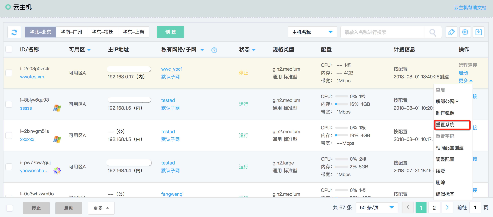
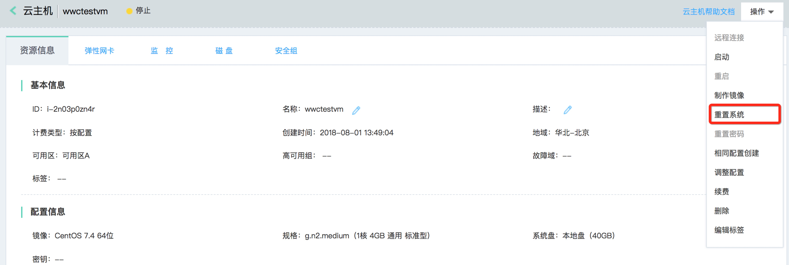
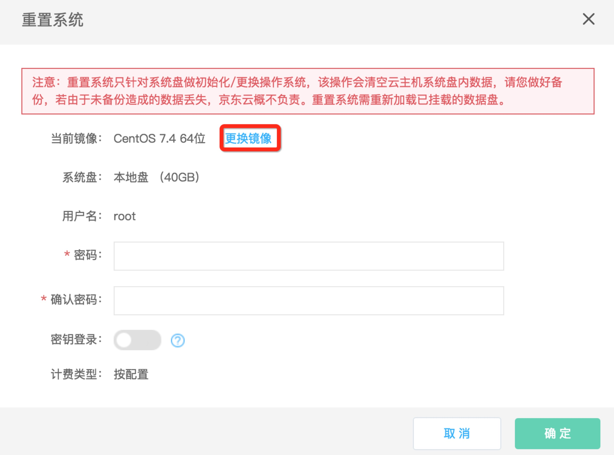
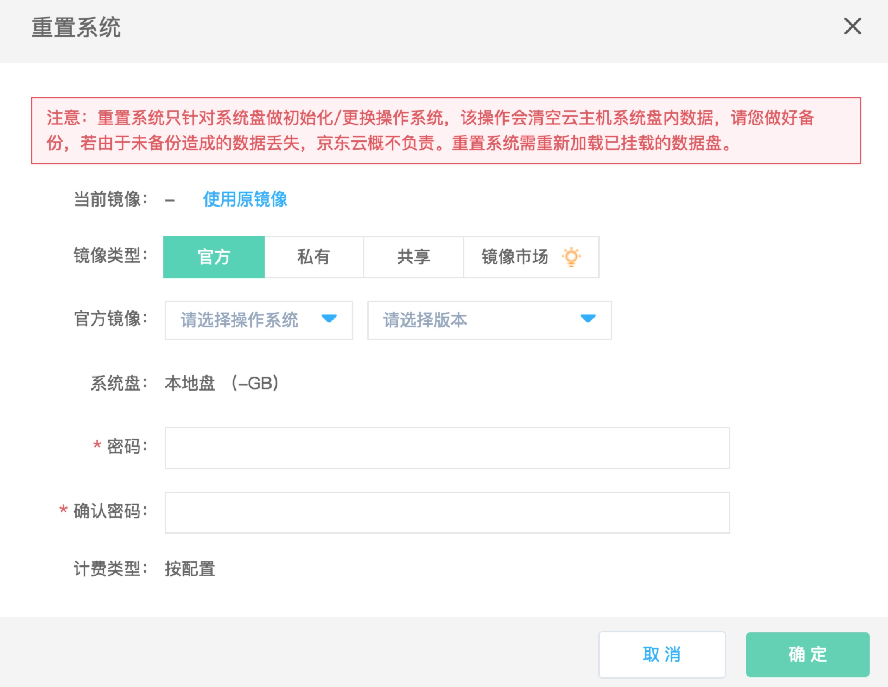

# 重置系统

您可以通过重置系统操作使实例恢复至刚创建时的系统状态，是一种在实例遭遇软件故障时的恢复手段。同时如果您希望沿用当前主机规格而更换所使用的操作系统，也可以通过重置系统操作完成。您可以选择重置实例至 Linux 类型系统或者重装至 Windows 类型系统。

需要注意的是，重装系统会导致系统盘的内容全部丢失，数据盘的数据不受影响（但需要重新识别）。因此，在需要保留系统运行数据的情况下，强烈建议您在重置系统前[制作私有镜像](http://docs.jdcloud.com/cn/virtual-machines/create-private-image)，之后重置时选择该私有镜像即可实现保留系统运行数据。

## 前提条件

* 实例必须处于“已停止”状态。若实例处于“运行中”状态，请先操作[停止实例](Stop-Instance.md)；若实例处于其他非稳定状态，还请等待前序操作执行完成后再操作调整配置。
	
		请注意：：
		* 若实例基于私有镜像创建，而私有镜像已被删除，则无法使用原镜像重置系统，即无法恢复至刚创建时的系统状态，建议保留被实例引用的私有镜像；
		* 重置系统需要重新指定密码，对于Linux系统您还可以重新指定SSH密钥；

## 操作步骤
1. 访问[云主机控制台](https://cns-console.jdcloud.com/host/compute/list)，即进入实例列表页面。或访问[京东云控制台](https://console.jdcloud.com)点击左侧导航栏【弹性计算】-【云主机】进入实例列表页。
2. 选择地域。
3. 在实例列表中选择需要重置系统的实例，确认其状态为“已停止”。
4. 点击【操作】-【更多】-【重置系统】按钮，或点击实例名称进入详情页后点击【操作】-【重置系统】按钮。
 
5. 弹出“重置系统”弹窗，默认选择您创建实例时所用镜像，即可恢复至创建时系统状态。若您需要更换至其他镜像，则点击弹窗中【更换镜像】按钮切换至选择镜像界面，您可按需选择镜像 
6. 设置新的登录密码，点击【确定】触发重置系统。

之后实例将进入“重置系统中”状态，重置完成后将恢复成“已停止”状态，操作“启动”实例后即可正常使用实例。
## 相关参考

[制作私有镜像](http://docs.jdcloud.com/cn/virtual-machines/create-private-image)

[停止实例](Stop-Instance.md)
