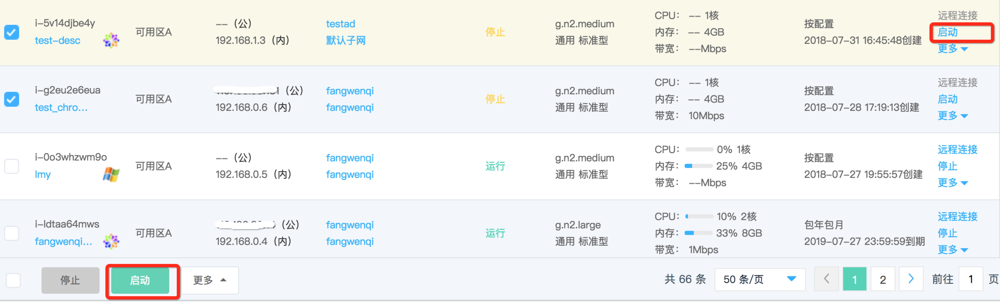

# 启动实例

如果您需要将已停止的实例重新投入使用，您可通过操作启动实例实现。

## 前提条件

实例必须处于“已停止”状态。若实例处于“运行中”状态，则说明实例已完成启动，无需二次操作；若实例处于其他非稳定状态，还请等待前序操作执行完成后再操作启动。
	
	请注意：
	* 若按配置计费实例已欠费或包年包月实例已到期则会停服，此时实例处于“已停止”状态，进行启动实例操作会失败。
	* 触发启动操作后实例将进入“启动中”状态，实例将无法进行其他操作。当启动完成后，实例将进入“运行中”状态。

## 操作步骤

1. 访问[云主机控制台](https://cns-console.jdcloud.com/host/compute/list)，即进入实例列表页面。或访问[京东云控制台](https://console.jdcloud.com)点击左侧导航栏【弹性计算】-【云主机】进入实例列表页。
2. 选择地域。
3. 在实例列表中选择需要启动的实例，确认其状态为“已停止”。如果需要同时操作多台实例，可通过多选实现。
4. 单台操作：点击【操作】-【启动】按钮，或点击实例名称进入详情页后点击【操作】-【启动】按钮；
 批量操作：点击列表下方【启动】按钮

5. 在弹出的“启动实例”弹窗中，确认信息，点击【确定】提交启动。

之后实例将进入“启动中”状态，实例将无法进行其他操作。当启动完成后，实例将进入“运行中”状态。
