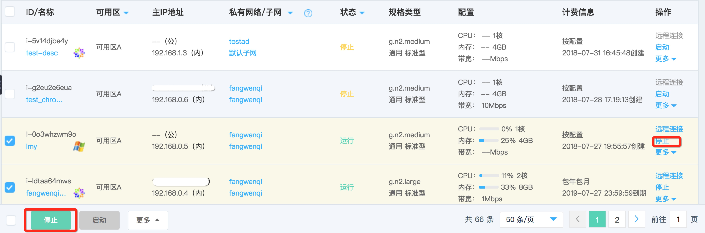

# 停止实例

如果您需要暂停的实例服务或作为其他操作的前置条件，如重置系统等，您可操作停止实例。

## 前提条件

实例必须处于“运行”状态。若实例处于“停止”状态，则说明实例已完成停止，无需二次操作；若实例处于其他非稳定状态，还请等待前序操作执行完成后再操作停止。
	
	请注意：
	* 停止操作会造成您业务中断，还请谨慎操作；
	* 停止操作将清空您本地数据盘内数据；
	* 触发停止操作后实例将进入“停止中”状态，实例将无法进行其他操作。当停止完成后，实例将进入“停止”状态。

## 操作步骤
1. 访问[云主机控制台](https://cns-console.jdcloud.com/host/compute/list)，即进入实例列表页面。或访问[京东云控制台](https://console.jdcloud.com)点击左侧导航栏【弹性计算】-【云主机】进入实例列表页。
2. 选择地域。
3. 在实例列表中选择需要停止的实例，确认其状态为“运行”。如果需要同时操作多台实例，可通过多选实现。
4. 单台操作：点击【操作】-【停止】按钮，或点击实例名称进入详情页后点击【操作】-【停止】按钮；
 批量操作：点击列表下方【停止】按钮

5. 在弹出的“停止实例”弹窗中，确认信息，点击【确定】提交启动。

实例将进入“停止中”状态，实例将无法进行其他操作。当停止完成后，实例将进入“停止”状态。
