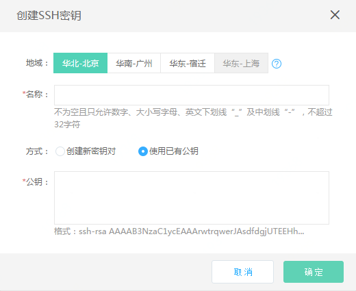

# 创建密钥

## 操作步骤
1. 访问[SSH密钥控制台][1]，或访问[京东云控制台][2]点击左侧导航栏【弹性计算】-【云主机】-【SSH密钥】进入密钥列表页。
2. 选择要使用密钥的地域， 点击【创建】开始密钥创建流程。
3. 为将要保存在京东云的公钥命名。
4. 选择密钥创建方式： 
   * 创建新密钥对：京东云会为您创建一个密钥对。其中京东云保存公钥，您保存私钥，需注意的是，您只有一次下载私钥的机会，请在链接有效期内及时下载私钥。
   * 使用已有公钥：将您本地的公钥文件上传到京东云，以此种方式创建时请确保您本地保存有与公钥配对的私钥。
5. 创建成功后，可以在密钥的详情页内查看公钥明文信息。
注意：若选择创建新密钥对，创建后控制台会提供下载私钥界面，请您务必需要保存好对应的私钥，并确保私钥不在Internet上传播。京东云不会保存您的私钥，下载私钥的链接只在10分钟内有效，请及时下载。

  [1]: https://cns-console.jdcloud.com/host/ssh/list
  [2]: https://console.jdcloud.com/