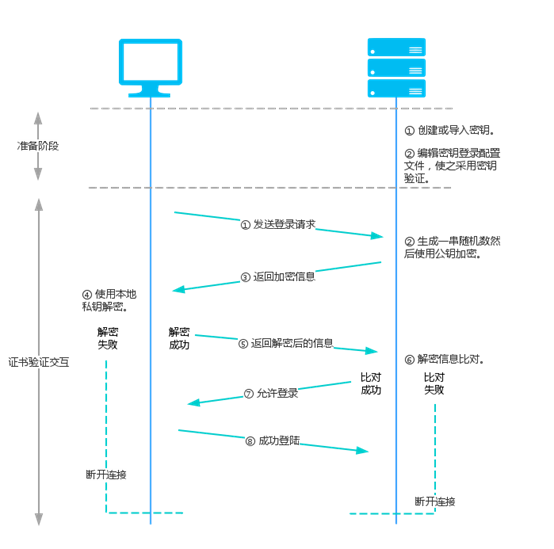

# 密钥概述
京东云为您提供两种安全可靠的登录实例方式：密码登录及SSH密钥登录。其中只有Linux系统实例支持使用SSH密钥。

SSH密钥登录是指使用密钥技术对登录信息进行加密解密，为云主机提供一个较之密码登录更加安全的登录方式，进一步提升云主机的安全。

对于密钥登录，您需要创建一对唯一匹配密钥对：“公钥”和“私钥”：

* 公钥需存储在京东云上，用于对数据进行加密，公钥是公开的，可以按需将其配置到目标服务器与您使用的用户名关联。
* 私钥需您存储在安全的位置，私钥只能对与之匹配的公钥所加密的数据进行解密，SSH 客户端使用私钥向服务器证明您的合法身份。

## 原理流程
使用SSH密钥登录实例过程如下：

### 准备阶段：
1. 您创建密钥对（新生成或导入），将私钥保存至本地。
2. 编辑远端云主机密钥登录配置文件，将公钥信息写入对应目录文件中。

### 证书校验交互阶段：

1. 用户发送登录请求至远端云主机。
2. 远端云主机在对应用户目录及文件中读取到该云主机的有效公钥，生成一串随机数，并使用公钥对其加密。
3. 远端云主机将其返回至用户。
4. 用户使用本地私钥对其进行解密。
5. 用户将解密结果返回至远端云主机进行信息比对。若比对成功则用户登录成功，否则则登录失败。

京东云在控制台提供密钥创建及对应管理注入实例操作入口，此外也支持您对实例自行进行相应的配置。详细请参考[创建密钥](../Operation-Guide/Key-Pair/Create-Keypair.md)。

## 相关参考

[创建密钥](../Operation-Guide/Key-Pair/Create-Keypair.md)

  [1]: ./images/Operation-Guide-keypair-overview1.png "Operation-Guide-keypair-overview1.png"