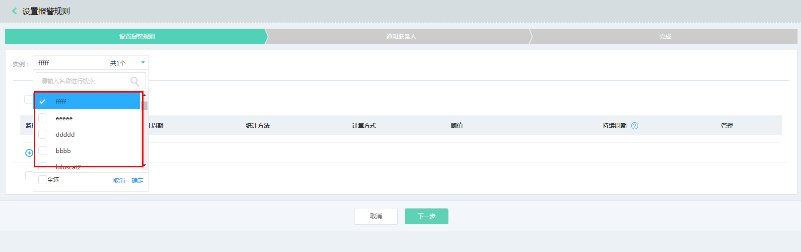
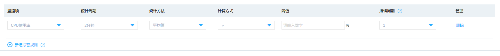
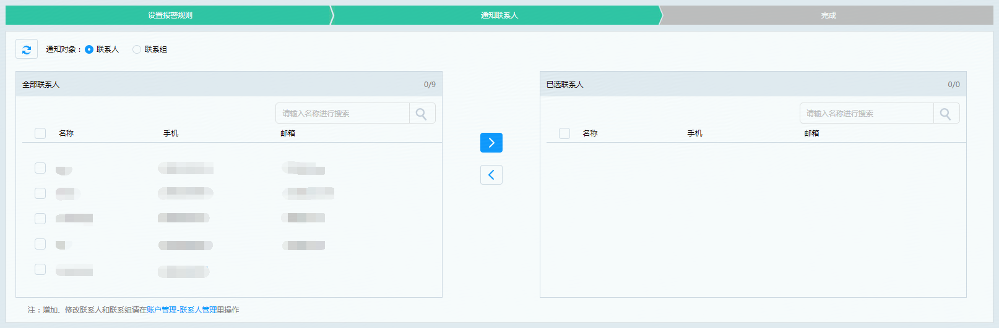

# 设置报警规则
您可针对实例不同监控项设置不同的报警规则，当满足规则时即触发报警向您发送邮件及短信。

## 操作步骤
1. 访问[云监控-云主机监控控制台](https://cms-console.jdcloud.com/serverMonitor)，或访问[京东云控制台](https://console.jdcloud.com/)点击左侧导航栏【管理】-【云监控】-【资源监控】-【云主机监控】进入实例监控列表页。
2. 找到您所需要查看监控数据的实例，点击【操作】-【监控表】进入监控详情页
3. 点击【报警规则标签】切换至报警规则选项，点击新增报警。
4. 支持针对多个实例同时设置报警规则。

5. 可选择使用当前已有报警规则模板或新建报警规则，也可将配置后的规则设置成新的报警规则模板以方便下次使用。

6. 若选择新建报警规则，需要配置监控项、统计周期、统计方法、计算方式、阈值及持续周期。

	针对实例，以上各项支持情况如下：

| 配置项 | 配置要求|
| :--- | :---   |
| **监控项**   | CPU使用率、内存使用率、磁盘读吞吐量、磁盘写吞吐量、网络进速率及网络出速率 |
| **统计周期**    |  2分钟、5分钟、15分钟、30分钟及1小时，默认为2分钟   |
|  **统计办法**   |  平均值、最大值、最小值及总和，默认为平均值   |
|  **计算方式**   |  ＞、≥、＜、≤、＝及≠，默认为＞   |
|  **阈值**   |   根据不同监控项不同，若为使用率则最小值为0%，最大值为100%  |
|  **持续周期**   | 1、2、3及5，默认为1，统计周期内监控项的值持续超过阈值则计数加1，否则则清零，若该计数超过设置值则触发报警    |

7. 设置报警通知联系人，支持设置联系人或联系人组，完成配置后即可正常监测实例运行状况。
