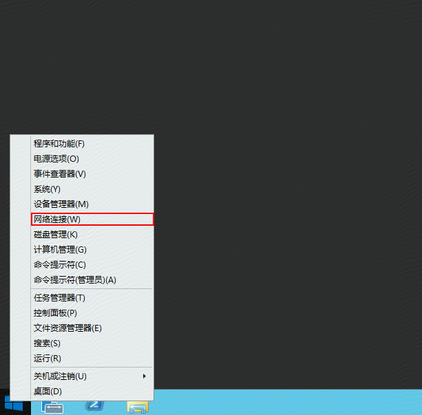
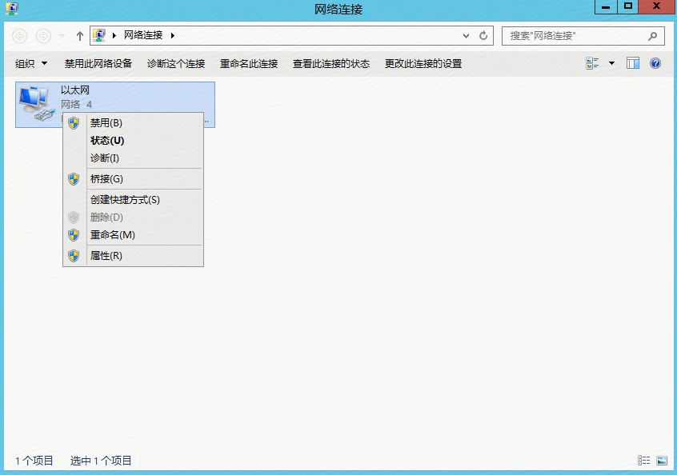
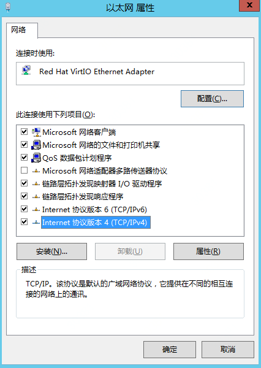
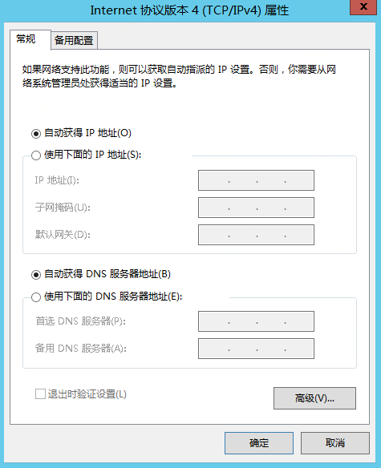
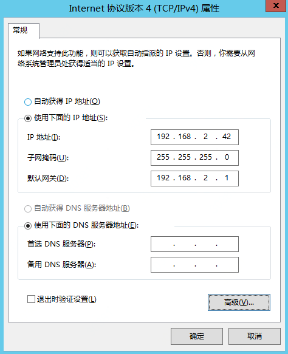
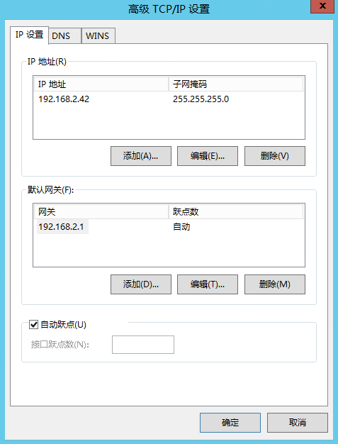
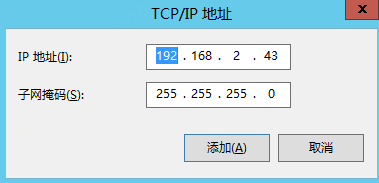
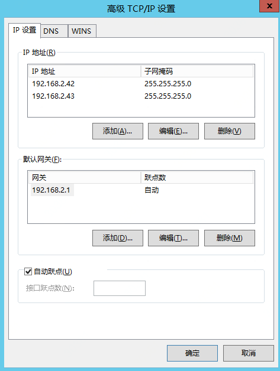
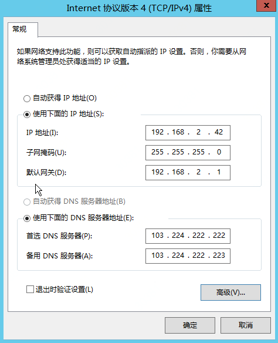

# 分配辅助内网IP

京东云内网IP是无法通过Internet访问的IP地址，京东云支持您为实例的不同弹性网卡分配多个内网IP地址，分别为对应弹性网卡的主内网IP及辅助内网IP，每一个内网IP均可以绑定一个弹性公网IP：

主内网IP地址：弹性网卡创建时分配的首个内网IP地址，可由用户指定或系统分配，不支持释放。

辅助内网IP地址：弹性网卡分配的除主IP以外的其它内网IP地址，可由用户指定或系统分配，支持释放。

## 前提条件

单弹性网卡可内网IP数上限为21，即除去主内网IP外可分配20个辅助内网IP。当已分配辅助内网IP数未达上限时，您可操作分配辅助内网IP。
	
	请注意：实际可分配内网IP数还受限于弹性网卡所在子网剩余可用IP数。

## 操作步骤

1. 访问[云主机控制台](https://cns-console.jdcloud.com/host/compute/list)，即进入实例列表页面。或访问[京东云控制台](https://console.jdcloud.com)点击左侧导航栏【弹性计算】-【云主机】进入实例列表页。
2. 选择地域。
3. 在实例列表中选择需要分配辅助内网IP的实例，点击名称进入详情页。
4. 点击【弹性网卡】Tab，选择需要分配IP的弹性网卡，点击【分配内网IP】按钮。
5. 在弹出弹窗中添加需要分配的内网IP，可选择由系统自动分配内网IP地址，或自定义内网IP地址，需注意的是需要从当前弹性网卡所在子网CIDR范围内指定，且不能与已占用地址冲突。支持同时分配多个，点击【确定】。
		
		请注意：
		* 在控制台操作完成后还需要登录实例进行配置才能生效。

此外您还可以从弹性网卡控制台进行分配操作，详细步骤请参见[弹性网卡侧分配辅助IP](../../../../Networking/Elastic-Network-Interface/Operation-Guide/Private-IP-Management/Assign-Secondary-IP.md)。

## 配置实例

### Linux系统

Linux系统以CentOS 7.2为例，详细操作如下：

1. 登录实例，详细请查阅[登录Linux实例](../../Getting-Start-Linux/Connect-To-Instance.md)

2. 以主网卡示例，若为辅助网卡则对应修改为eth1、eth2等。执行命令 

		vim /etc/sysconfig/network-scripts/ifcfg-eth0

	示例：若当前实例在控制台查询到的内网IP分别为192.168.0.4及192.168.0.5，其中192.168.0.4为主IP，文件内容显示：

	```
	TYPE="ETHERNET"  
	BOOTPROTO="dhcp"
	DEFROUTE="yes"
	PEERDNS="yes"
	PEERROUTES="yes"
	IPV4_FAILURE_FATAL="no"
	IPV6INIT="yes"
	IPV6_AUTOCONF="yes"
	IPV6_DEFROUTE="yes"
	IPV6_PEERDNS="yes"
	IPV6_PEERROUTES="yes"
	IPV6_FAILURE_FATAL="no"
	NAME="eth0"
	UUID="dd73a4ea-8f6b-409b-a271-5f7882a3ae53"
	DEVICE="eth0"
	ONBOOT="yes"</pre>
	```
	修改为以下内容并保存：

	```
	TYPE="ETHERNET"
	#BOOTPROTO="dhcp"
	DEFROUTE="yes"
	PEERDNS="yes"
	PEERROUTES="yes"
	IPV4_FAILURE_FATAL="no"
	IPV6INIT="yes"
	IPV6_AUTOCONF="yes"
	IPV6_DEFROUTE="yes"
	IPV6_PEERDNS="yes"
	IPV6_PEERROUTES="yes"
	IPV6_FAILURE_FATAL="no"
	NAME="eth0"
	UUID="dd73a4ea-8f6b-409b-a271-5f7882a3ae53"
	DEVICE="eth0"
	ONBOOT="yes"
	IPADDR0="192.168.0.4"
	IPADDR1="192.168.0.5"
	NETMASK1="255.255.255.0"
	NETMASK2="255.255.255.0"
	GATEWAY="192.168.0.1"
	```
	请注意，要将BOOTPROTO="dhcp"注释。

3. 重启网卡。

		systemctl restart network

4. 检查 eth0 网卡是否已经加入了 IP 地址。
		
		ip addr
		
5. 完成内网 IP配置。
	
		注：此种方式配置的内网 IP 在实例重启后依旧生效，但是如果为此实例制作自定义镜像后，基于此私有镜像创建的其他实例内网 IP 需要自行按照以上配置方法更新配置。

### Windows系统

Windows系统以Windows Server 2012 R2 标准版 64位 中文版为例，详细操作如下：

1. 登录实例，详细请查阅[登录Windows实例](../../Getting-Start-Windows/Connect-To-Instance.md)。

	示例：若需要配置在子网 192.168.2.0/24 内的 IP 192.168.2.43（辅助IP），当前主内网IP为IP 192.168.2.42。

2. 在左下角右键点击"开始"按钮，选择网络连接。<br>
3. 出现网络连接，右键点击后选择“属性”。<br>
4. 打开属性后，选择“Internet协议版本4（TCP/IPv4）”，点击“属性”。<br>
5. 打开属性后，显示如下<br><br>将内容修改为下图所示后，再点击“高级”<br>
6. 点击高级后显示如下图<br>
<br>点击“添加”，按下图填写，点击“添加”确认<br><br>点击“确认”回到属性页<br><br>在DNS服务器地址处填写写“103.224.222.222”及“103.224.222.223”后点击“确定”即设置完成

## 相关参考

[弹性网卡侧分配辅助IP](../../../../Networking/Elastic-Network-Interface/Operation-Guide/Private-IP-Management/Assign-Secondary-IP.md)

[登录Linux实例](../../Getting-Start-Linux/Connect-To-Instance.md)

[登录Windows实例](../../Getting-Start-Windows/Connect-To-Instance.md)
