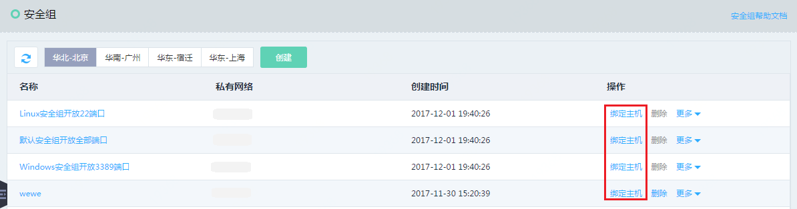

# 绑定安全组
您可以在实例创建时绑定安全组，也可以在实例创建之后，在安全组页面选择安全组与指定实例绑定。

实例的每块网卡必须与至少一个安全组绑定。

## 操作步骤
1. 访问[云主机控制台](https://cns-console.jdcloud.com/host/compute/list)，即进入实例列表页面。或访问[京东云控制台](https://console.jdcloud.com)点击左侧导航栏【弹性计算】-【云主机】进入实例列表页。
2. 选择地域。
3. 在实例列表中选择需要绑定安全组的实例，点击名称进入详情页。
4. 点击【安全组】Tab-【添加】按钮。
5. 在弹出弹窗中，选择一个或多个安全组，点击【确定】。 

		请注意：实例侧仅支持对实例主网卡进行安全组绑定操作，若要对实例辅助网卡操作，请从安全组侧操作。
	
此外您还可以从安全组控制台进行绑定操作，详细步骤请参见[安全组侧绑定实例](../../../../Networking/Virtual-Private-Cloud/Operation-Guide/Security-Group-Configuration.md)。