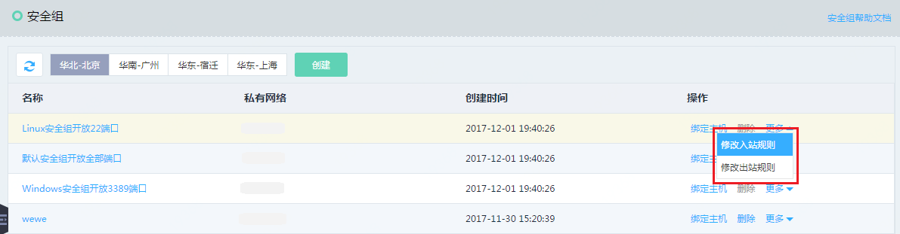
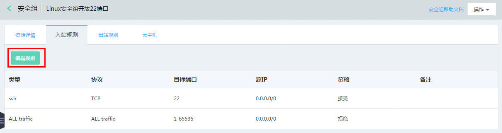
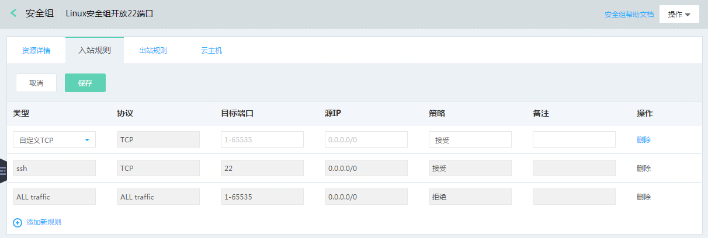

# 配置安全组入站规则
入站规则用于过滤云互联网或其他云主机访问当前当前主机的网络流量。

## 注意事项
* 安全组规则是有状态的，如果您通过配置入站规则允许外部向实例发送一个请求，则无论出站规则如何配置，都将允许该请求的响应流量流出。
## 操作步骤
1. 访问[安全组控制台](https://cns-console.jdcloud.com/host/netSecurity/list)，或访问[京东云控制台](https://console.jdcloud.com/overview)点击左侧导航栏【弹性计算】-【云主机】-【安全组】进入安全组列表页，找到需要配置入站规则的安全组，点击【更多】操作中的【修改入站规则】或点击安全组名称跳转到其详情页面。

2. 进入入站规则TAB页，点击页面上的【编辑规则】按钮，进入入站规则编辑页面。

3. 点击页面下方的【添加新规则】按钮将为当前安全组新增一条入站规则，选择入站规则类型，系统将根据所选择的入站规则类型自动匹配相应协议，依次设置端口（支持单个端口号，如80，也支持端口范围如：80-8080）、目的IP（支持单个IP或CIDR）、备注（支持全字符，不超过26字符）后完成一条入口规则的配置。
4. 您也可以随时对页面上已添加的安全组入站规则进行编辑。
5. 点击操作列中的【删除】按钮，将删除一条对应的入站规则。
6. 完成入站规则编辑后，点击页面上方的【保存】按钮后，新修改的安全组规则自动生效。

  [1]: ./images/Operation-Guide-SG-inbound1.png "Operation-Guide-SG-inbound1.png"
  [2]: ./images/Operation-Guide-SG-inbound1.png "Operation-Guide-SG-inbound1.png"
  [3]: ./images/Operation-Guide-SG-inbound1.png "Operation-Guide-SG-inbound1.png"
  [4]: ./images/Operation-Guide-SG-inbound2.png "Operation-Guide-SG-inbound2.png"
  [5]: ./images/Operation-Guide-SG-inbound3.png "Operation-Guide-SG-inbound3.png"