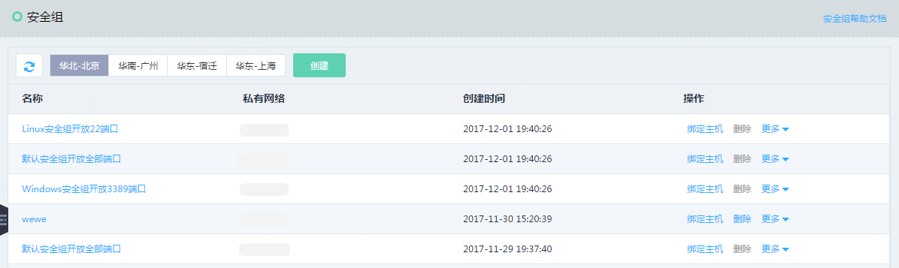

# 创建安全组
安全组可以作用于相同地域下隶属同一私有网络内的任意实例，在创建安全组之前需要先创建私有网络。

## 操作步骤
1. 访问[安全组控制台][1]，或访问[京东云控制台][2]点击左侧导航栏【弹性计算】-【云主机】-【安全组】进入安全组列表页，点击【创建】，弹出创建弹框。

2. 首先您需要选择安全组所在的地域和私有网络，安全组只能应用在相同私有网路下的实例。您可以为当前已创建的私有网络新建安全组，也可以点击【新建私有网络】按钮，跳转到新建私有网络页面，创建新的私有网络。
    
	单个私有网络下最多可以创建50个安全组，如所选择的私有网络下安全组数量已达到50个，则会提示“所选私有网络资源安全组限额已达到50个”，您需要重新选择其他私有网络。

3. 输入安全组名称及描述，描述用于对安全组规则的额外说明，如“开放了入口方向80、443端口”；建议您用安全组的使用场景或功能作为安全组的名称，如 " Web服务器集群开放80端口 " 。

4. 点击【确定】完成安全组创建，新建安全组默认拒绝所有入口、出口流量，建议创建成功之后即刻前往详情页设置出站／入站规则。

  [1]: https://cns-console.jdcloud.com/host/netSecurity/list
  [2]: https://console.jdcloud.com/