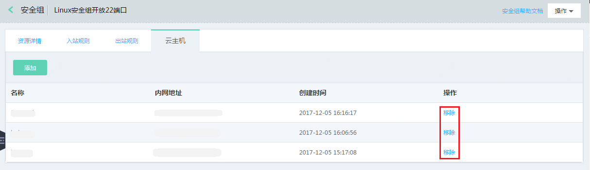

# 解绑安全组

## 操作步骤
1. 访问[云主机控制台](https://cns-console.jdcloud.com/host/compute/list)，即进入实例列表页面。或访问[京东云控制台](https://console.jdcloud.com)点击左侧导航栏【弹性计算】-【云主机】进入实例列表页。
2. 选择地域。
3. 在实例列表中选择需要绑定安全组的实例，点击名称进入详情页。
4. 点击【安全组】Tab。
5. 找到需要解绑的安全组，点击【解绑】按钮。
	
6. 在弹出确认弹窗中，点击【确定】按钮。

		请注意：
		* 如果当前安全组是当前实例主网卡所绑定的唯一安全组，在则在为实例绑定其他安全组之前，无法移除当前安全组。
		* 实例侧仅支持对实例主网卡进行安全组解绑操作，若要对实例辅助网卡操作，请从安全组侧操作。

此外您还可以从安全组控制台进行解绑操作，详细步骤请参见[安全组解绑实例](../../../../Networking/Virtual-Private-Cloud/Operation-Guide/Security-Group-Configuration.md)。