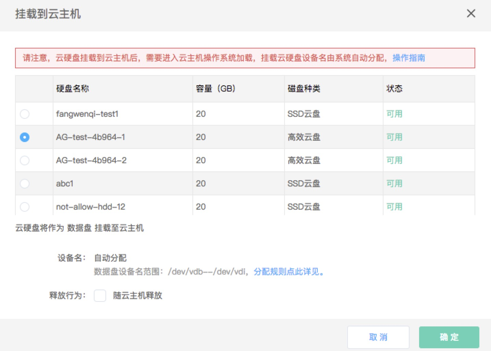
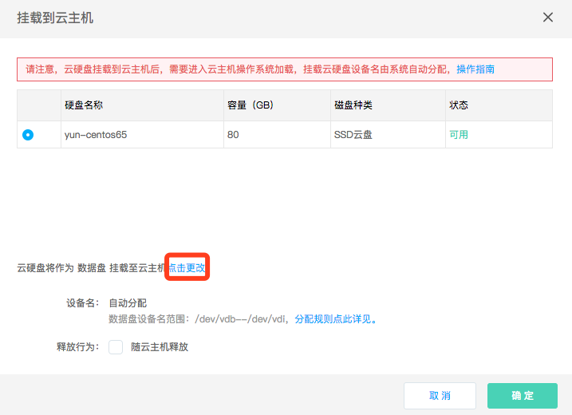
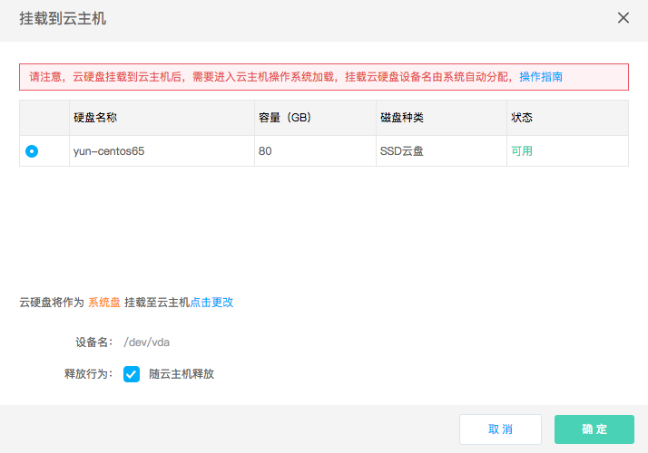

# 挂载云硬盘

## 前提条件
* 实例当前已挂载云硬盘数不可达到上线，即8块云硬盘。若实例系统盘为云硬盘，则可挂载7块云硬盘作为数据盘。
* 若要将云硬盘作为实例系统盘挂载至实例，则实例当前需未挂载系统盘，即未挂载设备名为 /dev/vda 的云硬盘，同时实例需要处于“已停止”状态，且待挂载盘容量在40GB～500GB之间。
* 多点挂载云硬盘只可作为数据盘挂载，且至多可挂载至16台实例。

## 操作步骤

### 作为数据盘挂载

云硬盘默认作为数据盘挂载至实例，详细操作步骤如下：

1. 访问[云主机控制台](https://cns-console.jdcloud.com/host/compute/list)，即进入实例列表页面。或访问[京东云控制台](https://console.jdcloud.com)点击左侧导航栏【弹性计算】-【云主机】进入实例列表页。
2. 选择地域。
3. 在实例列表中选择需要挂载云硬盘的实例，点击名称进入详情页。
4. 点击【磁盘】Tab-【挂载】按钮。
5. 在弹出弹窗中，选择一块云硬盘。若选择的是按配置计费的且非多点挂载云硬盘，则可设置随云主机删除属性（释放行为），若勾选则在实例删除时将一起删除对应云硬盘，若不勾选则在实例删除时云硬盘将保留。包年包月云硬盘或多点挂载盘无法指定删除属性，实例删除时保留。

### 作为系统盘挂载

若实例当前需未挂载系统盘，即未挂载设备名为 /dev/vda 的云硬盘，可以将云硬盘作为系统盘挂载至实例。详细操作步骤如下：

1. 访问[云主机控制台](https://cns-console.jdcloud.com/host/compute/list)，即进入实例列表页面。或访问[京东云控制台](https://console.jdcloud.com)点击左侧导航栏【弹性计算】-【云主机】进入实例列表页。
2. 选择地域。
3. 在实例列表中选择需要挂载云硬盘的实例，点击名称进入详情页。
4. 点击【磁盘】Tab-【挂载】按钮。
5. 在弹出弹窗中，选择一块云硬盘。  
点击更改，则可作为系统盘挂载至云主机

多点挂载云硬盘不支持作为系统盘挂载。若选择的是按配置计费的且非多点挂载云硬盘，则可设置随实例删除属性（释放行为），对于系统盘默认随实例删除，属性可修改。若勾选则在实例删除时将一起删除对应云硬盘，若不勾选则在实例删除时云硬盘将保留。包年包月云硬盘无法指定删除属性，实例删除时保留。

	请注意：
	* 实例需处于“已停止”状态；
	* 待挂载盘容量需在40GB～500GB之间。

此外您还可以从云硬盘控制台进行挂载操作，详细步骤请参见[云硬盘侧挂载](http://docs.jdcloud.com/cn/cloud-disk-service/attach-cloud-disk)。

tab页内云硬盘挂载状态将变更为“挂载中”，挂载云盘需要一定时间，还请您耐心等候并刷新页面，挂载成功后挂载状态将变更为“已挂载”。云硬盘在挂载完后还需要进行分区、格式化等一系列操作。具体操作方式请见：[Linux系统数据盘分区及格式化](http://docs.jdcloud.com/cn/cloud-disk-service/linux-partition)、[Windows系统盘分区及格式化](http://docs.jdcloud.com/cn/cloud-disk-service/windows-partition)

## 相关参考

[云硬盘侧挂载](http://docs.jdcloud.com/cn/cloud-disk-service/attach-cloud-disk)

[Linux系统数据盘分区及格式化](http://docs.jdcloud.com/cn/cloud-disk-service/linux-partition)

[Windows系统盘分区及格式化](http://docs.jdcloud.com/cn/cloud-disk-service/windows-partition)