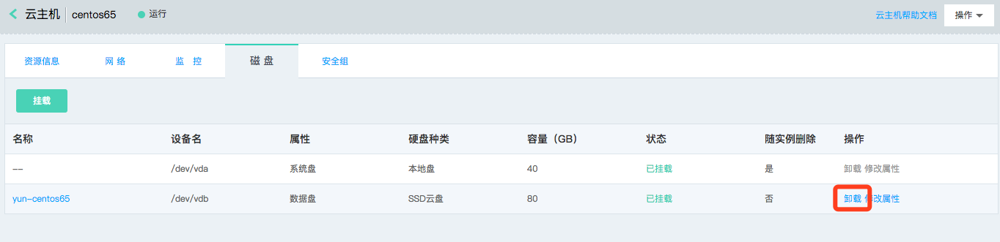

# 卸载云硬盘
## 前提条件
若要卸载实例的系统盘，实例需要处于“已停止”状态。

## 操作步骤
### 卸载数据盘

云硬盘默认作为数据盘挂载至实例，详细操作步骤如下：

1. 访问[云主机控制台](https://cns-console.jdcloud.com/host/compute/list)，即进入实例列表页面。或访问[京东云控制台](https://console.jdcloud.com)点击左侧导航栏【弹性计算】-【云主机】进入实例列表页。
2. 选择地域。
3. 在实例列表中选择需要卸载云硬盘的实例，点击名称进入详情页。
4. 点击【磁盘】Tab，找到需要卸载云硬盘，点击【卸载】按钮。
5. 在弹出的二次确认弹窗中，点击确认。

此外您还可以从云硬盘控制台进行卸载操作，详细步骤请参见[云硬盘侧卸载](http://docs.jdcloud.com/cn/cloud-disk-service/detach-cloud-disk)。

tab页内云硬盘挂载状态将变更为“卸载中”，卸载云盘需要一定时间，还请您耐心等候并刷新页面，卸载成功后挂载状态将变更为“已卸载”，此状态将保留15分钟，处于该状态的云硬盘不占用实例已挂载盘数量。

## 相关参考

[云硬盘侧卸载](http://docs.jdcloud.com/cn/cloud-disk-service/detach-cloud-disk)