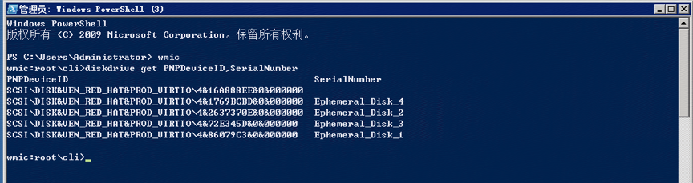

# 查看本地数据盘

本地数据盘为实例提供临时的块存储空间。本地盘是从实例所在物理机的本地存储区域内划分的一块存储区域。本地数据盘适用于频繁变更且需频繁访问的临时数据如缓存或临时数据等，或在一组实例间同步的数据如负载均衡后端服务器的服务状态数据。

实例规格不同，则本地数据盘块数及单盘容量实例类型不同。对于同一实例规格，本地数据盘块数及单盘容量均不可调整。

	请注意：本地数据盘的数据将在实例关机时清空。
	
为了保证数据不同类型数据存储在合适的盘里，您需要系统内识别并区分本地数据盘及云硬盘，详细步骤参考如下。

## 操作步骤

### Linux系统

Linux以 CentOS 7.4 系统为例，操作步骤如下：

1. 访问[云主机控制台](https://cns-console.jdcloud.com/host/compute/list)，即进入实例列表页面。或访问[京东云控制台](https://console.jdcloud.com)点击左侧导航栏【弹性计算】-【云主机】进入实例列表页。
2. 选择地域。
3. 在实例列表中选择需要查看本地数据盘的实例，[登录Linux实例](https://docs.jdcloud.com/cn/virtual-machines/connect-to-linux-instance)
4. 输入：

	```
	ll /dev/disk/by-id
	```
	
5. 如下入所示，其中virtio-Ephemeral\_Disk\_1至virtio-Ephemeral\_Disk\_4即为对应四块本地数据盘<br>

### Windows系统

Windows已 Windows 2008 标准版 系统为例，操作步骤如下：

1. 访问[云主机控制台](https://cns-console.jdcloud.com/host/compute/list)，即进入实例列表页面。或访问[京东云控制台](https://console.jdcloud.com)点击左侧导航栏【弹性计算】-【云主机】进入实例列表页。
2. 选择地域。
3. 在实例列表中选择需要查看本地数据盘的实例，[登录Windows实例](https://docs.jdcloud.com/cn/virtual-machines/connect-to-windows-instance)
4. 输入：

	```
	wmic
	diskdrive get PNPDeviceID,SerialNumber
	```
	
5. 如下入所示，其中序列号Ephemeral\_Disk\_1至Ephemeral\_Disk\_4即为对应四块本地数据盘<br>

## 相关参考

[登录Linux实例](https://docs.jdcloud.com/cn/virtual-machines/connect-to-linux-instance)

[登录Windows实例](https://docs.jdcloud.com/cn/virtual-machines/connect-to-windows-instance)
