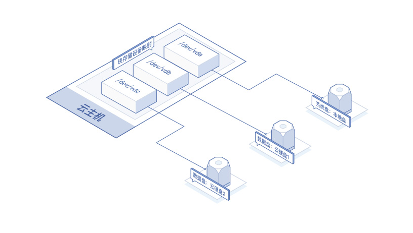

# 存储概述
京东云实例提供不同类型、可组合的数据存储设备，不同类型及不同容量大小的存储设备具有不同的性能及价格，分别适用于不用的使用场景。根据不同维度，可将其划分为以下几类：
<table>
   <tr>
      <td> 维度 </td>
      <td>分类 </td>
      <td> 说明 </td>
   </tr>
   <tr>
      <td rowspan="2"> 存储介质  </td>
      <td> 机械硬盘 </td>
      <td> 数据存储在机械硬盘上。性价比高，且读写速度较优。   </td>
   </tr>
   <tr>
      <td> SSD硬盘 </td>
      <td> 数据存储在固态硬盘（SSD）上。其IOPS及读写速度表现优异，均高于机械硬盘，价格较之机械硬盘也更高。 </td>
   </tr>
   <tr>
      <td rowspan="2"> 使用场景   </td>
      <td> 系统盘   </td>
      <td> 用于存储控制、协调实例以及支持应用开发及运行的系统，使用镜像来操作。  </td>
   </tr>
   <tr>
      <td> 数据盘  </td>
      <td> 用于存储用户数据。 </td>
   </tr>
   <tr>
      <td rowspan="2"> 架构模式   </td>
      <td> 本地盘   </td>
      <td> 本地盘是从实例所在物理机的本地存储区域内划分的一块存储区域。与实例同在一台物理机器上可获得较低的访问时延，但同时存在数据单点故障的风险。本地数据盘将在实例关机时清空盘内数据，如果您的应用架构不能实现数据可靠性，建议您使用云硬盘存储重要数据。</td>
   </tr>
   <tr>
      <td>云硬盘  </td>
      <td> 云硬盘是一种弹性、高可用且高可靠的数据块级存储。云硬盘内的数据以三重实时副本的方式存储，避免因组件故障导致数据不可用。云硬盘容量可弹性扩展，您可以在几分钟内以低廉的价格扩充数据存储空间，并实现数据的持久化存储。     </td>
   </tr> 
</table>

##根据架构模式分类

### 本地盘
本地盘与实例同在一台物理机上。使用本地盘的实例可以获得更小的数据访问时延。本地盘生命周期同实例生命周期，本地系统盘数据随实例删除而丢失，本地数据盘数据则在实例关机时丢失，如果您的应用架构不能实现数据可靠性，建议您使用云硬盘存储重要数据。

### 云硬盘
云硬盘是数据块级别的存储设备，三副本架构使其具有高可用性。

京东云提供存储介质不同提供两类云硬盘，分别是高效云盘及SSD云盘。目前可使用云硬盘作为实例的数据盘，其生命周期与实例实例独立，可随实例一起购买也可在实例创建完成后单独购买再挂载至实例，也支持从当前实例上卸载下来并挂载至其他实例上。

此外可以支持创建可多点挂载的云硬盘。详细介绍请参见[多点挂载云硬盘](Strorage-Overview#user-content-1)。

可以对云硬盘创建快照来保留数据的备份副本，并随时从快照创建新的云硬盘，并将其连接到另一台实例。有关云硬盘的更多信息，请参考[京东云云硬盘产品文档](http://docs.jdcloud.com/cn/cloud-disk-service/product-overview)。

## 根据存储用途分类

### 系统盘

实例支持使用本地盘及云硬盘作为其系统盘。

若使用本地盘作系统盘可获得更低的数据访问时延，赠送40GB容量，不支持对系统盘进行扩容操作。

若使用云硬盘作为系统盘可获得更高的数据可靠性，支持配置40GB~500GB容量，支持卸载后扩容操作。

### 数据盘

实例支持使用本地盘及云硬盘作为其数据盘。其中：

**本地盘** 当前仅GPU云主机提供，数据随云主机关机而清除。不建议存储重要数据。

**云硬盘** 支持两类，分别为高效云盘及SSD云盘。每个实例至多可挂载四块数据盘，若需调整此限额请[提交工单][1]申请，更多信息，请参考[京东云云硬盘产品文档](http://docs.jdcloud.com/cn/cloud-disk-service/product-overview)。

## 块存储设备映射
每个实例均有一块系统盘用以保证基本运行数据，还可以向实例挂载更多数据盘，详细请查阅[挂载云硬盘](Attach-Cloud-Disk.md)。实例使用块存储设备映射来将这些存储设备映射为自身可以识别的位置。

块存储是以字节为单位分块的存储设备，支持随机访问。京东云支持两种类型的块储存设备：

* 系统盘（本地盘或云硬盘）
* 数据盘（云硬盘）

此图显示了如何将块存储设备映射到实例上，将 /dev/vda 映射到系统盘上，并将两块数据盘分别映射到 /dev/vdb 及 /dev/vdc。不同操作系统内设备名或有不同，以实例系统内显示为准。
实例会自动为挂载至其的本地盘及云硬盘创建块存储设备映射。

## 多点挂载云硬盘

多点挂载云硬盘是一种支持多台实例并发读写访问的数据块级存储设备，具备多并发、高性能、高可靠等特性，支持政企、金融等行业常用的Oracle RAC等高可用架构场景。单块共享块存储最多可以同时挂载到16台实例。

多点挂载云硬盘只能作数据盘用，暂不支持随实例一起创建，需要单独创建，请参见[创建云硬盘](http://docs.jdcloud.com/cn/virtual-machines/create-cloud-disk)。不支持设置随实例删除属性，删除其挂载的实例时，多点挂载云硬盘将保留。

挂载到实例上时，其与非多点挂载云硬盘共享单台实例可挂载云硬盘限额，即一台实例最多挂载8块云硬盘。

## 相关参考
[京东云云硬盘产品文档](http://docs.jdcloud.com/cn/cloud-disk-service/product-overview)

[创建云硬盘](http://docs.jdcloud.com/cn/virtual-machines/create-cloud-disk)

[挂载云硬盘](Attach-Cloud-Disk.md)

  [1]: https://ticket.jdcloud.com/myorder/submit
