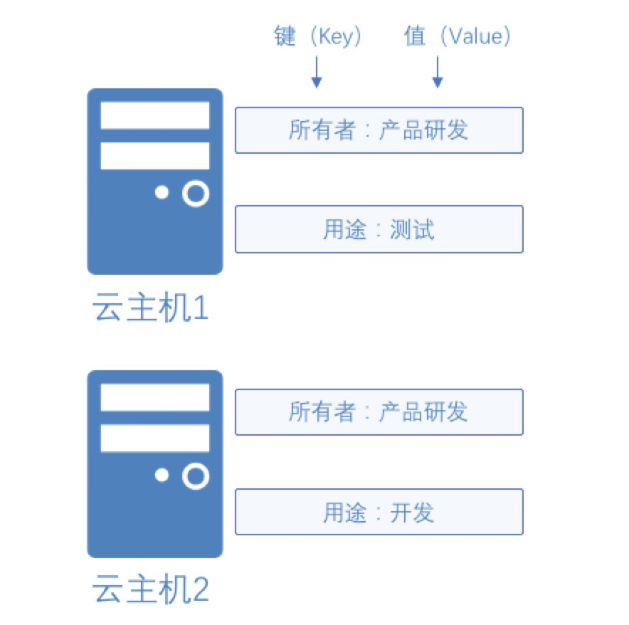

# 标签概述

标签提供一种可支持多种分类规范（如：所有者、用途等）的资源分类方法，方便用户在拥有大量同类资源时快速根据标签定位特定资源。标签由一对键/值（Key-Value）组成，均由用户定义。例如，用户可以根据云主机所有者标识其云主机资源。此外，建议用户对不同类型资源如云主机、云数据库等采用同一批标签，可以更加方便用户管理京东云上资源。

上图示意了标签实现情况，对于实例1及实例2均绑定了两个标签，分别为所有者及用途。其中实例1及实例2的所有者均为产品研发，实例1的用途为测试，实例2的用途为开发。

## 支持功能

* [编辑标签](Edit-Tag.md)
* [根据标签筛选云主机](Filter-by-Tag.md)

## 使用限制

* 每台云主机最多可以绑定 10 个标签。
* 标签键（Key）最大长度为127个字符。
* 标签值（Value）最大长度为255个字符。
* 标签键/值不可使用 jrn: 前缀，仅支持中文、数字、大小写字母、空格及特殊符号_.:/=+-@，不可以空格开头，区分大小写。
* 实例与标签绑定时，对于同一标签键（Key）只允许有一个对应标签值（Value），对于同一个标签键最近绑定的值会覆盖之前绑定的值。
* 解绑标签时，如果解绑之后该标签已经没有绑定的资源，则该标签会自动删除。

## 相关参考

[编辑标签](Edit-Tag.md)

[根据标签筛选云主机](Filter-by-Tag.md)

