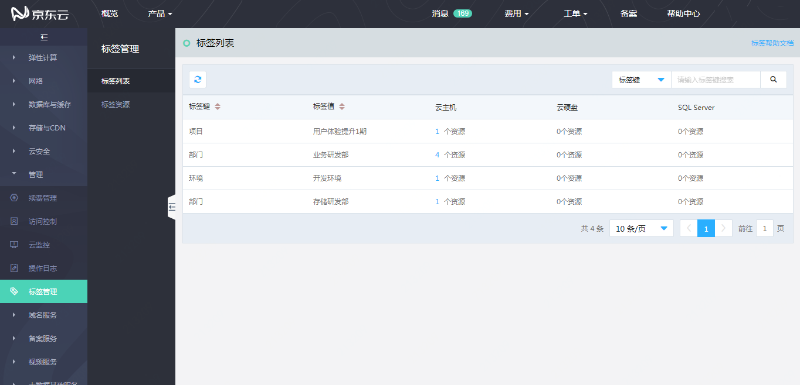
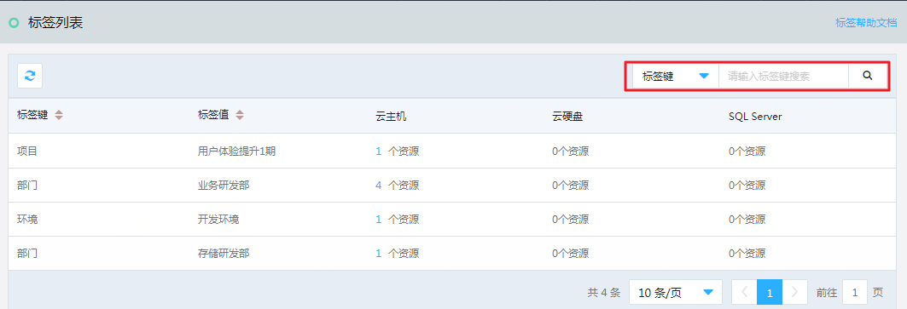
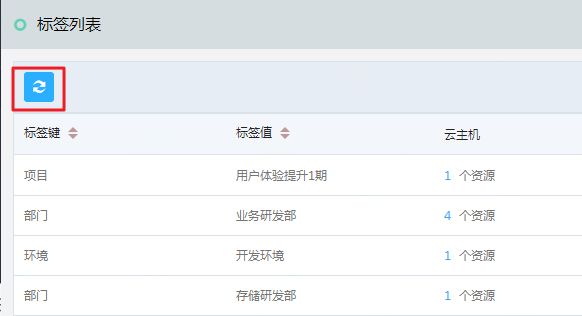
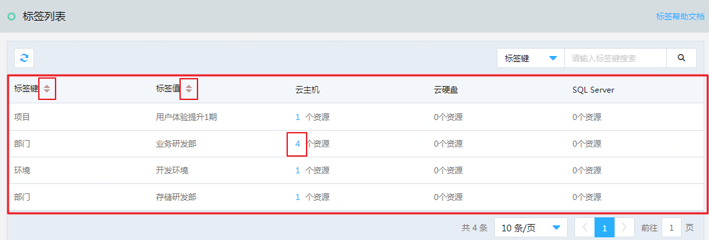

# 标签列表

在标签列表中，您可以看到您账号下所有绑定了资源的标签以及每个标签下资源的数量（包括“云主机”、“云硬盘”和“SQL Server”三种资源）。

## 搜索

您可以在右上方的搜索栏中，按照“标签键”或“标签值”对标签进行搜索，以找到您所想找寻的标签键或值，及它们绑定的资源。

搜索支持对标签键和值的模糊搜索，您可以仅输入标签键或值中的部分内容，而得到所有包含搜索内容的结果。

## 刷新列表

点击标签列表页左上方的“刷新”按钮，将对当前搜索结果的数据进行刷新，从而获得该搜索条件先最新的数据。

## 标签列表

您可以在标签列表中看到账号下所有绑定了资源的标签以及每个标签下资源的数量（包括“云主机”、“云硬盘”和“SQL Server”三种资源）。
您可以通过点击“标签键”或“标签值”右侧的升序、降序按钮，对列表内的数据进行按标签键或值的升降序排列。
通过点击某一标签右侧某一资源的数量，可以进入“标签资源”页面，看到这类资源所有已绑定标签的资源列表。

