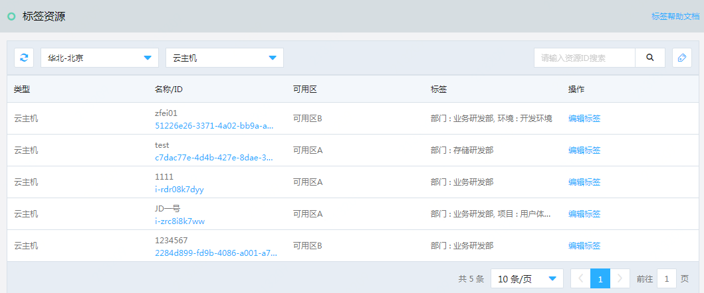
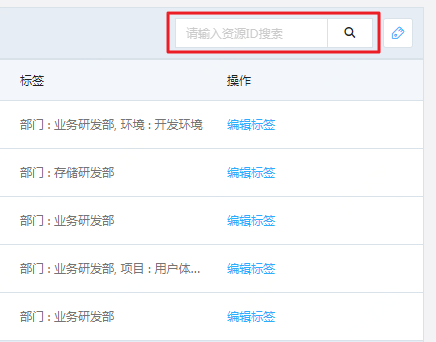
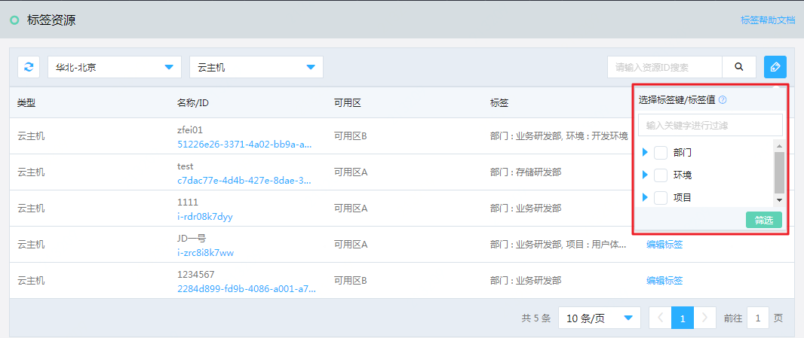
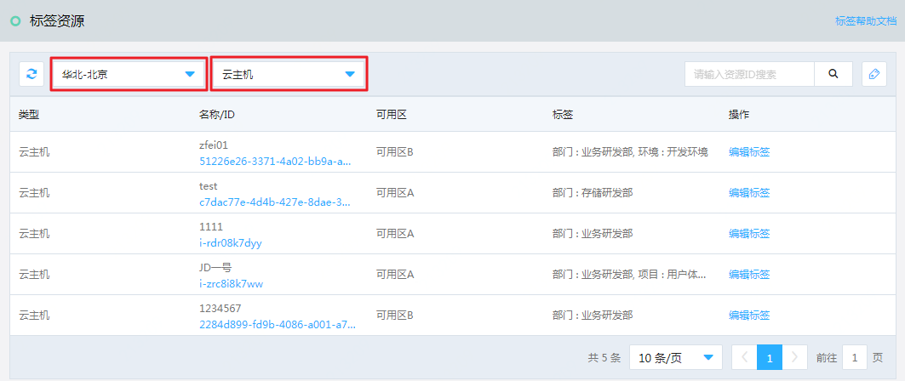
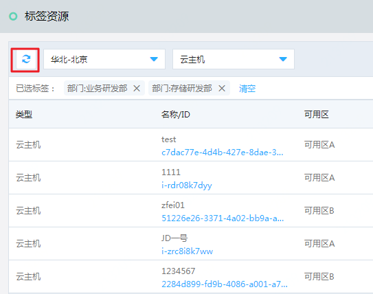
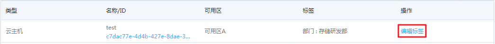
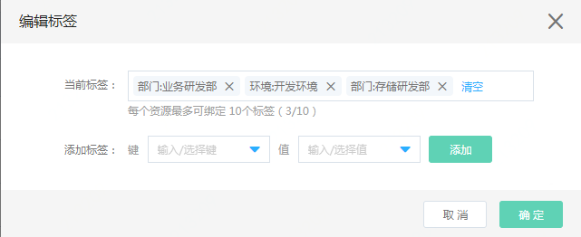

# 操作指南

## 标签资源
在标签资源中，您可以看到所有已绑定标签的资源，包括它们的类型、名称、ID、所属可用区以及已绑定的标签信息。

### 通过ID搜索资源
可以在标签自愿的右上方搜索框中，通过输入资源ID搜索资源，并得到该资源绑定了哪些标签。

### 通过标签筛选资源
当鼠标移至资源列表右上方的标签筛选按钮时，会根据左侧当前所选区域和产品类型展开标签筛选框，展现该条件下所有已绑定资源的标签树（标签键加标签值）。您可以通过勾选一个或多个标签键、值，对列表中的资源进行筛选，从而得到您所需的包含特定标签的资源集合。

当一次勾选多个标签键、值作为搜索条件时，同键不同值的标签在搜索条件中是“或”的关系，不同键的标签在搜索条件中是“且”的关系。

筛选完成后，您所选的筛选条件会出现在列表的上方。您可以通过去除其中某些标签进行重新筛选，或者完全清空标签筛选条件。

### 切换地域/资源类型
您可以通过标签资源列表左上方的下拉框对资源列表展现数据的区域或产品线进行切换。

### 刷新
您可以通过点击标签资源列表左上方的刷新按钮对当前资源列表中的数据进行刷新。刷新不会改变已有的筛选条件，并提供该条件下最新的资源数据。

### 资源详情
您可以通过点击某条资源的资源ID进入到该资源的详情页面。

### 编辑标签
您可以通过点击每条数据右侧的“编辑标签”按钮，对该资源进行标签的绑定或解绑操作。编辑标签时，可以进行多次绑定或解绑操作，再点击“确定”按钮，一次完成多个标签的绑定和解绑操作。
您可以通过下拉框选择已有的标签绑定当前资源，也可以输入新的标签键和值来创建一个新的标签并绑定给当前资源。
标签的键和值均不允许为空。首尾的空格将自动被过滤，名称字符中包含的多个空格将被自动处理为1个空格。
每个资源最多绑定10个标签。每个用户最多可拥有500个标签。每个标签键最多可拥有500个不同的标签值。

