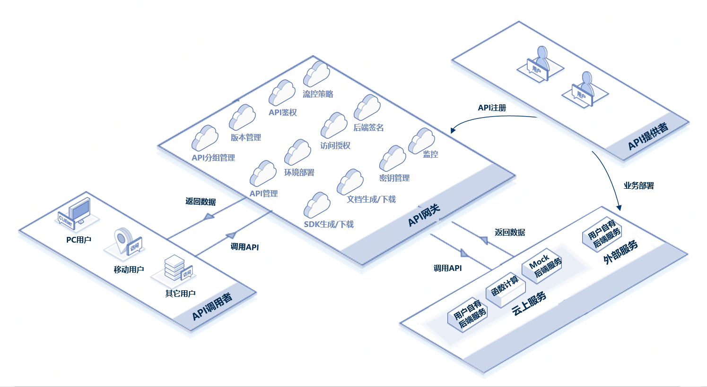

# 基础架构
API网关提供API提供者服务和API调用者服务。API提供者通过管理和部署API分组，向调用方提供API的调用；API调用者，通过访问密钥和API定义者的授权访问，使用API。

## 业务架构
业务架构如下图：

| 概念 | 解释 |
| :- | :- |
|  访问密钥  |  用户需要创建访问密钥, 作为调用 API 时的身份 。 |	
|   API 分组 |  API 提供方管理 API 的单元。创建 API 需要先创建分组 。 |
| 流控策略  | 用于 API 服务方对 API分组 、用户，按天、小时进行流量限制。|
| 访问授权   | 授予某个API分组的调用者，调用某个 API分组 的权限，由 API 提供方完成。  |
| 后端签名   | 网关访问API提供方时，通过添加后端签名进行访问 。 |
| 版本修订   | 每个API分组可以维护多个版本。每个环境下可指定版本进行发布  。 |
| 部署列表   | 服务发布部署。在 API分组 配置完成后，进行发布到具体环境后才可对外提供服务。现有环境包括：测试、预发、线上 。 |

## 相关参考

- [产品优势](../Introduction/Benefits.md)
- [产品功能](../Introduction/Features.md)
- [价格总览](../Pricing/Price-Overview.md)
- [计费规则](../Pricing/Billing-Rules.md)

