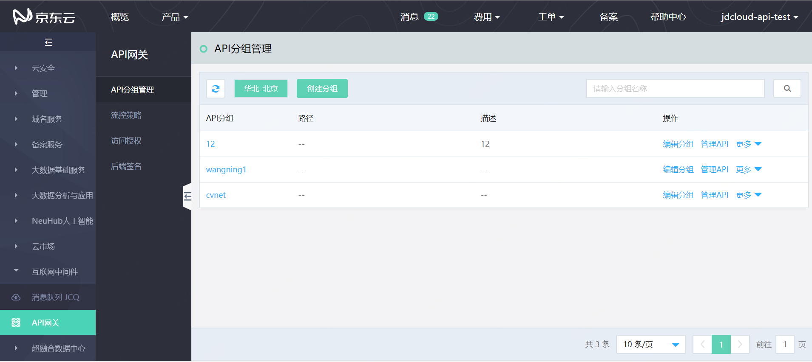
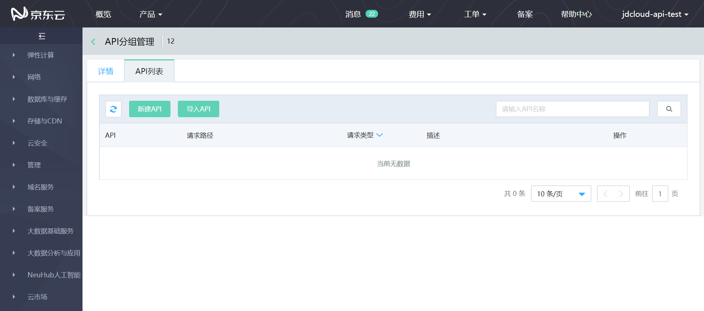
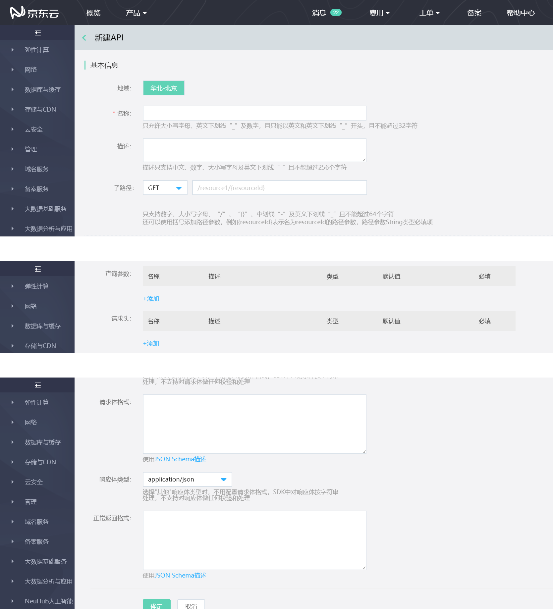

# 创建API

API分组是网关的基础服务单元并实现对外开放，而每个API分组下包含了具体的API。创建API的过程即API提供者定义API的过程。

创建API需要完成如下信息的定义：

* 	API的基本信息：地域、分组、名称、描述、子路径。

* 调用信息：查询参数、请求头、请求体类型、请求体格式、响应体类型、正常返回格式。

## 操作步骤：

1.在API分组列表页中，找到需要创建API的分组

 
 
点击该分组行的操作 **管理API**，进入“API列表”页

 

2. 在“API列表”页面，点击 **新建API** ，进入创建API页面。

 
  
3.填写API信息后，点击保存，即新建完成。

4.目前系统支持API导入功能，点击API列表页的 **导入API**  ,导入即可。注意，导入文件需要符合swagger 2.0规范。具体规范请参照：
[swagger 2.0规范](http://editor.swagger.io/)  
