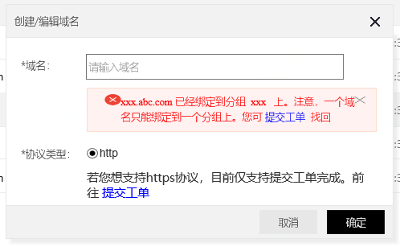

# 自定义域名

API网关提供基于 API分组的域名绑定。API网关通过域名来定位到一个唯一的 API分组，再通过Path+HTTPMethod 确定唯一的 API。独立域名需要满足以下几点：

* 独立域名要 CNAME 解析到该分组的二级域名上，然后操作绑定。先解析，后绑定，否则无法绑定。

* 一个域名只能绑定在一个分组上。

* 每个分组最多支持5个自定义域名绑定。如需增加可通过工单申请。

* 域名必须备案，才能绑定成功。

* 自定义域名仅支持线上环境，其它环境（测试、预发）暂不支持。

## 新增自定义域名过程
### 操作步骤：
#### STEP1:进入API分组的详情页，点击 自定义域名   **tab签** 。

#### STEP2:点击   **添加域名** 进行新增。目前每个分组支持最多绑定5个自定义域名

