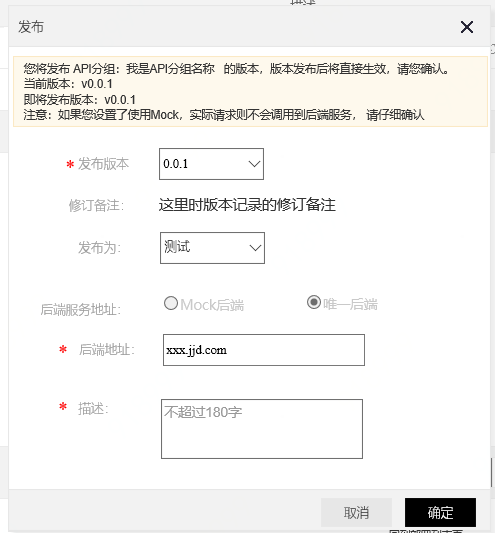
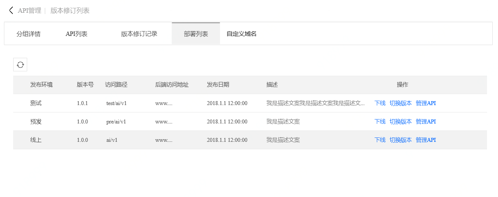
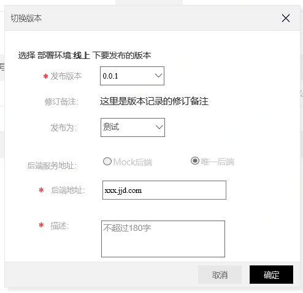
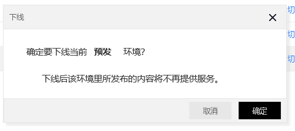

# 发布API分组

API分组信息创建完成后，需要通过发布才能使用。目前京东云提供了3套发布环境：测试、预发、线上。您可以在测试、预发环境中发布和测试API分组，并下载SDK和文档；在线上环境中正式发布上线 API分组的SDK和文档。

在发布完成后，API调用者可通过自定义域名或二级域名，访问调用API。

注意：

* 如果发布时选择的Mock后端，则调试时不会请求真实后端服务，而会直接返回常量结果。这种方式适用于调试 API 的请求链路是否正确，会跳过鉴权 和 签名校验 环节；

* 如果选择的唯一后端并录入后端地址后，则网关会真实地请求该后端服务。

## 操作步骤：

### STEP1:选择要进行发布的分组

首先，进入 **API分组管理**页，并找到要发布的分组

### STEP2:点击操作中的 **发布**：

说明：

1）选择要发布的版本。API网关支持分组的版本管理功能，因此在发布时，注意选择您需要发布的版本。后续还可在环境管理中切换或者下线不同的版本。
   
2）选择要发布的环境。API网关提供了三种环境：测试、预发、线上。

3）选择后端服务发布形式。目前支持Mock后端和真实后端两种形式。调试时，可以选择 Mock后端方式进行发布，则调试时不会去请求真实后端服务，而会直接返回常量结果。这种方式适用于调试 API 的请求链路是否正确，会跳过鉴权 和 签名校验 环节。

### STEP3:在部署管理中，管理各个环境下发布的版本：
发布完成后，可在部署管理页中，看到各个环境的部署情况。

API 网关支持对测试/线上的 API 做版本管理，您可以发布 API、下线 API 还可以切换版本，切换版本是实时生效。

### STEP4:下线
如需下线，可直接点击下线操作。实时生效。

