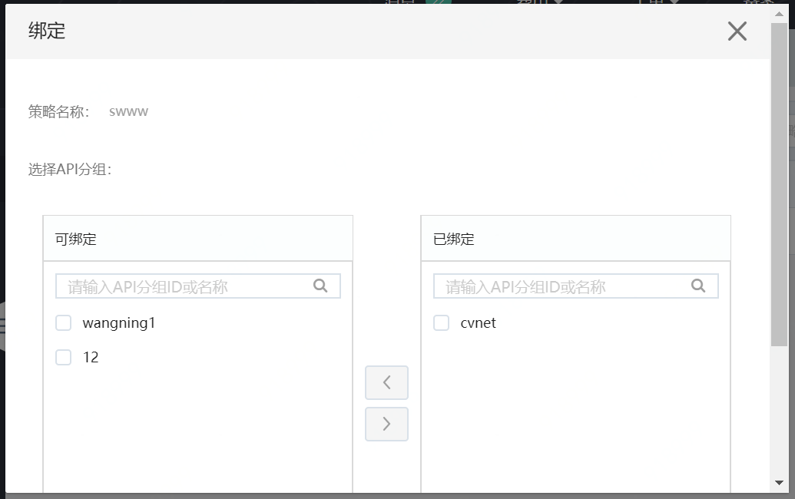

# 流控策略

API 网关为您提供流控策略，对API调用进行控制。流控策略需要绑定到 API分组上，才会对分组下的 API 起作用。

*  流控策略可以对API分组次数限制、对单Access Key次数限制。

*  请注意，单Access Key次数限制应不大于API分组流量限制。即 单Access Key次数限制 <= API分组流量限制。

*  每个 API 分组的默认流控上限是500QPS（该值可以通过提交工单申请提高）。

*  流控策略通过绑定 API分组生效。1个策略可以绑定于多个 API分组，且每一个 API分组 单独生效。

*  如果 API分组 已经与某个策略绑定，当您绑定新策略时，此次操作将替换之前的策略，实时生效。

*  在 API网关控制台，您可以完成对流控策略的创建、修改、删除、查看、绑定、解绑等基本操作。

*  流控的单位:分钟、天。

当您创建流量控制策略时，需要选择 Region，Region 一旦选定不可更改，且仅能被应用于同一个 Region 下的API使用。

## 操作步骤

1.点击左侧 **流控策略**，进入流控策略列表页，进行流控策略配置和绑定。

2.新增流控策略

3.给分组绑定策略

