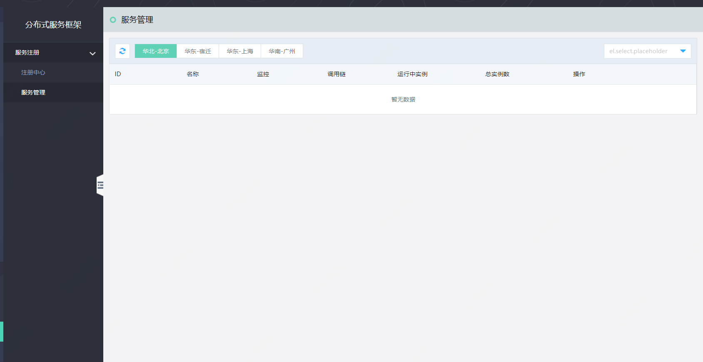

#  服务管理

服务是微服务平台管理的基本单元。目前控制台可查询注册中心下的服务下的服务内容。服务管理包括服务鉴权配置、查看实例列表等。

#### 入口
-	互联网中间件>分布式服务框架>服务注册>服务管理。
-	互联网中间件>分布式服务框架>服务注册>注册中心，查看某集群的服务管理

###  服务管理列表

  
 
####  说明：
-	在服务管理列表中，将根据不同的注册中心，展示该注册中心下的所有服务信息。
-	可根据右上的选择器，切换查看不同的注册中心下的服务。

