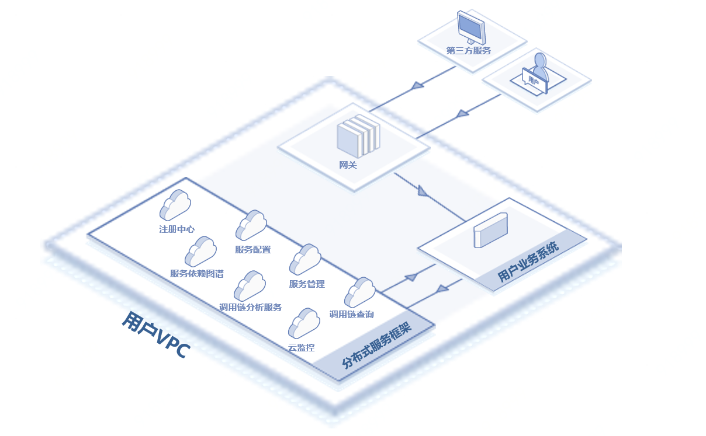
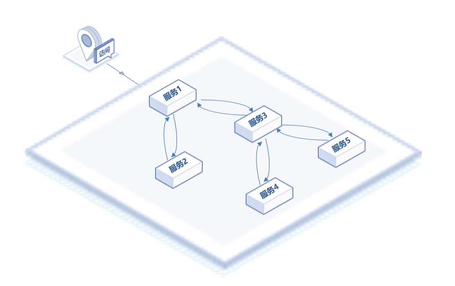

# 应用场景

以下说明云JDSF的适用场景。

## 构建微服务系统

基于京东云分布式服务框架，可以很容易地将自身业务迁移到微服务框架上。服务框架提供的功能，使用户不用再关注服务框架实现和运维，可以完全专注在业务的设计和拆分上。
 

## 调用关系管理

对于大型分布式而言，梳理调用关系以及管理调用权限往往是非常复杂的。京东云分布式服务框架内置的调用链分析功能和服务鉴权机制，可以有效的帮助用户管理服务调用过程。

