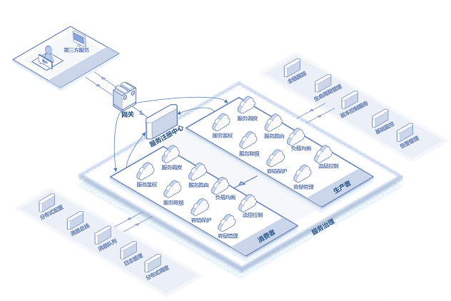

# 基础架构
京东云分布式框架 提供了 RESTful 调用方式和自研的高性能 RPC 框架，能够构建高可用、高性能的分布式系统，京东云分布式框架系统地考虑了分布式服务发现、路由管理、安全、负载均衡等细节问题。同时京东云分布式框架将在未来打通消息队列、API Gateway 等服务，满足用户多样化的需求。

## 业务架构

## JDSF产品功能名词

| 概念 | 解释 |
| :- | :- |
|  注册中心 | 注册中心为服务提供者访问地址信息的存储和查询服务。 |
| 服务注册  |  是当一个微服务实例在启动过程中，把当前服务实例的URL（地址和端口以及其他配置信息）写入注册中心，让调用方可以根据此信息对该实例进行访问。 |
|  服务管理  | 对写入到注册中心的服务实例数据进行管理的功能。  |
|  分区（region）  | S京东云云主机机房分布在全球多个位置，这些位置称为地域分区。每个地域分区（region）都是一个独立的地理区域，每个地域都是完全独立的。 |
|  集群网络  | 自定义的虚拟网络空间，实现资源间的逻辑隔离。 |
|  服务鉴权 |  用来保护服务时的权限认证，保证服务安全性的一项功能；如果该服务开启了鉴权，那么访问该服务的请求都会被鉴权，鉴权不通过返回鉴权失败。 |
|  调用链分析服务   |  调用链能够跟踪分布式服务每一次请求的调用路径，帮助用户了解、分析请求处理各个阶段的耗时情况和状态，从而全面掌握服务调用关系、精准发现系统的瓶颈和隐患的服务。 |
|  服务依赖图谱  | 根据调用链数据分析出服务间的调用角色和流程，帮助用户了解服务间的调用路径、服务的性能和状态统计，为用户进行问题的定位、排查以及优化提供决策数据。 |

## 相关参考

- [产品优势](../Introduction/Benefits.md)
- [产品功能](../Introduction/Features.md)
- [价格总览](../Pricing/Price-Overview.md)
- [计费规则](../Pricing/Billing-Rules.md)

