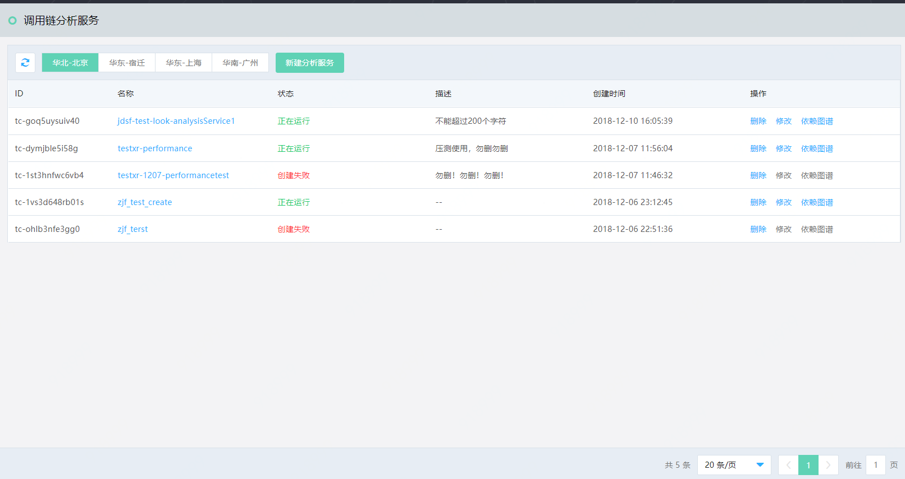
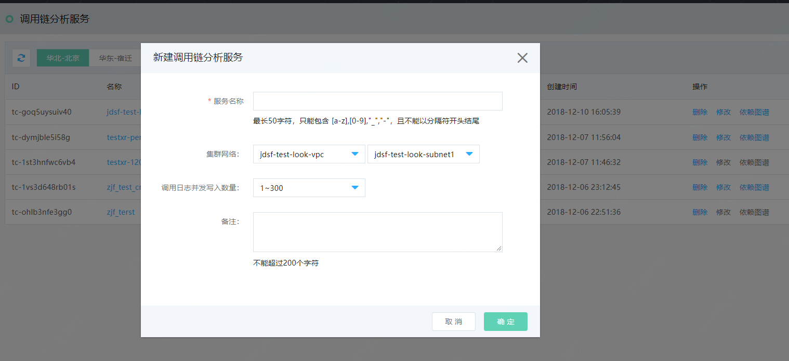

#  新建分析服务
调用链分析服务即提供了对某个服务、某个逻辑操作的执行情况进行的监控的功能。在微服务架构下，一个http请求从发出到响应，中间可能经过了很多个服务的调用，调用链分析服务对分析服务调用关系、耗时操作、性能瓶颈上价值很大。
	

调用链分析服务包括新建分析服务、删除、修改、调用链查询、依赖图谱。

## 操作步骤：
###  第1步：选择地域。
先选择分区，然后再在此分区中点击新建分析服务。如图所示，先选择“华北-北京”分区，再点击“新建分析服务”。
   
   
   
###  第2步：新建分析服务
您需依次录入服务名称、选择集群网络及子网ID、调用日志并发写入数量、填写备注。然后点击保存，完成创建过程
   
 
###  第3步：保存并创建成功后，可在调用链分析服务列表中，看见新增的分析服务。

