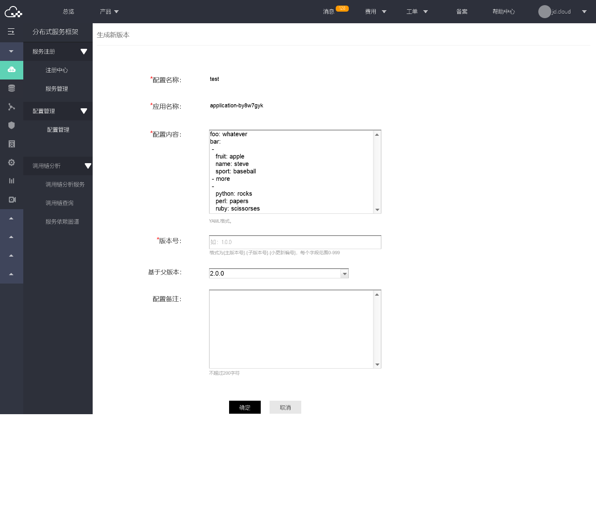

# 生成新版本

## 操作步骤：

### 第1步： 进入配置管理列表。
点击配置项的名称，进入版本列表页。
 
 
 
### 第2步：第2步：选择父版本，点击操作中的生成新版本，进入版本编辑页。保存后生成新版本。
 
  
  
#### 说明：
- 默认展示父版本内容
- 版本号大于父版本号
- 	当切换父版本时，“配置内容”更换至父版本内容.

### 第3步： 选择要发布的版本。点击发布。
填写发布信息，进行配置发布。
  
  
  
  
  
#### 说明：
发布后，新版本会替代原有版本作为线上版本。

