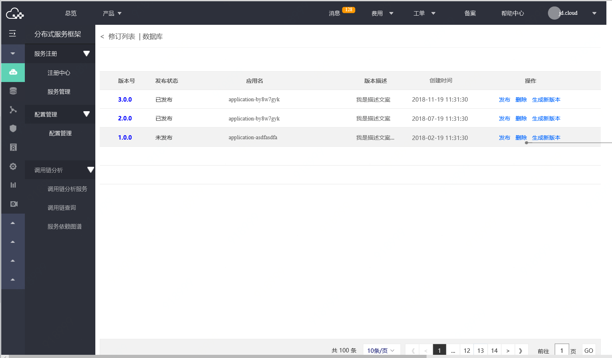
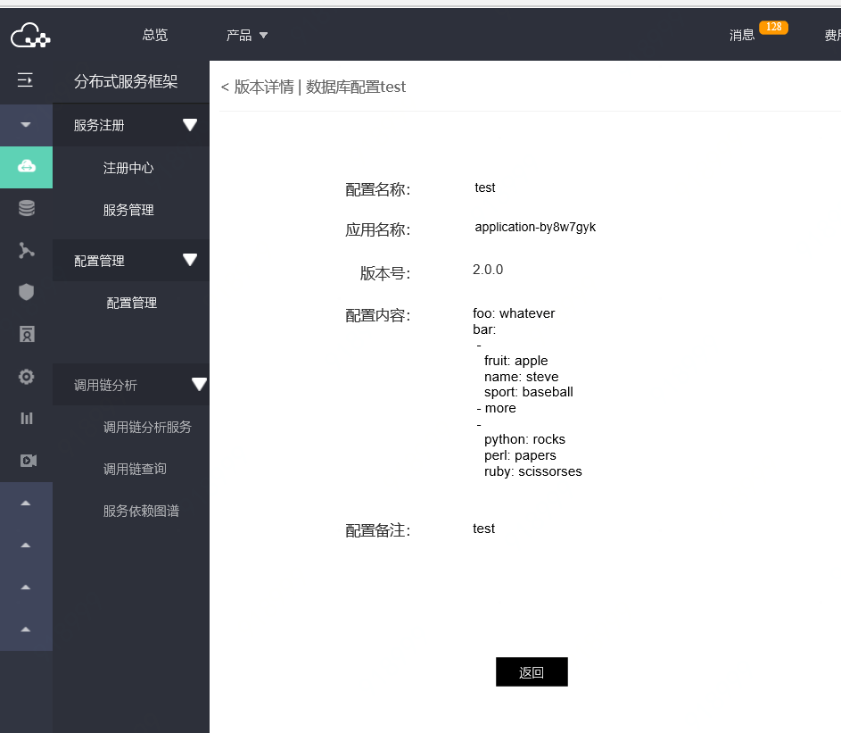

# 新建配置项

## 操作步骤：

### 第1步：进入配置管理列表，选择可用的区域region。
 
 
### 第2步：在区域中，点击新建配置，进入新建页
  
  
### 第3步：填写信息，并保存。
说明：
-	应用的名称由用户自行录入，并保证名称的正确。
-	同一服务上，不能创建同名配置。
-	新建成功后，同步生成版本信息。

### 第4步：查看配置项的版本管理
点击配置项的名称。进入版本列表页。
   
   
   
### 第5步：查看版本详情。
点击版本号名称可查看版本详情。
   
