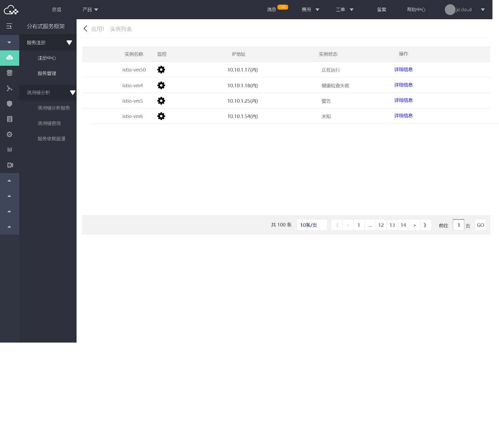
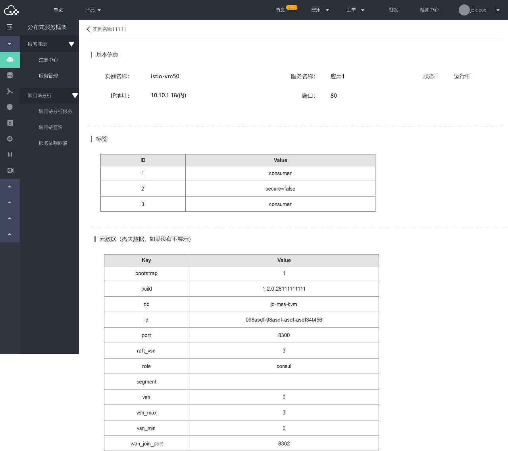

#  实例列表
用户可查看每个服务中存在的所有实例，并查看每个实例的详细信息。

## 操作步骤：

###  第1步：选择要操作的服务
点击列表右侧的实例详情操作。
  
  
###  第2步：查看实例列表信息。
实例详情列表展示的是当前服务下的所有实例信息。
   
  
  
  
###   第3步：查看实例详情信息。
点击列表右侧的详情信息操作，可查看某一实例的具体信息。
 
   
