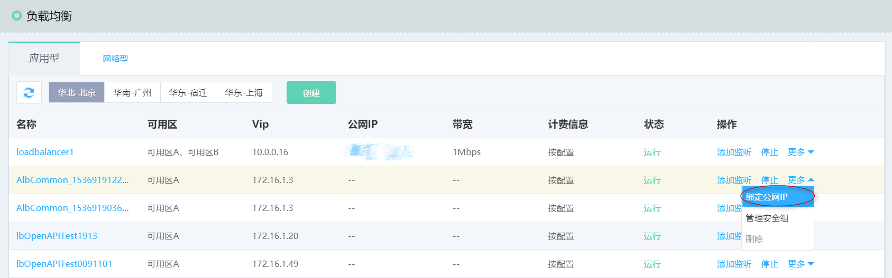

# 创建内网/外网应用负载均衡实例

可根据具体的业务场景选择购买、配置公网、内网类型的应用负载均衡实例。

## 内网应用负载均衡

- 内网应用负载均衡只能在京东云内网使用，可以转发对京东云内网具有访问权限的客户端请求。创建内网应用负载均衡的步骤如下：

	

	创建应用负载均衡时选择“暂不购买”公网IP，完成相关资源配置，则默认创建内网类型的应用负载均衡实例。
	
## 公网应用负载均衡

- 公网应用负载均衡可以将来自公网的访问请求流量转发至后端虚拟服务器，公网应用负载均衡需要单独购买公网IP，步骤如下：

	

	购买应用负载均衡时选择公网IP（不超过公网IP可创建配额），系统会自动为应用负载均衡创建并绑定一个公网IP。

## 内网应用负载均衡转为公网应用负载均衡

- 京东云支持内网、公网应用负载均衡类型互转，内网应用负载均衡可通过绑定公网IP转换为公网类型的应用负载均衡，公网应用负载均衡解绑公网IP后可转换为内网类型的应用负载均衡。

	

	
