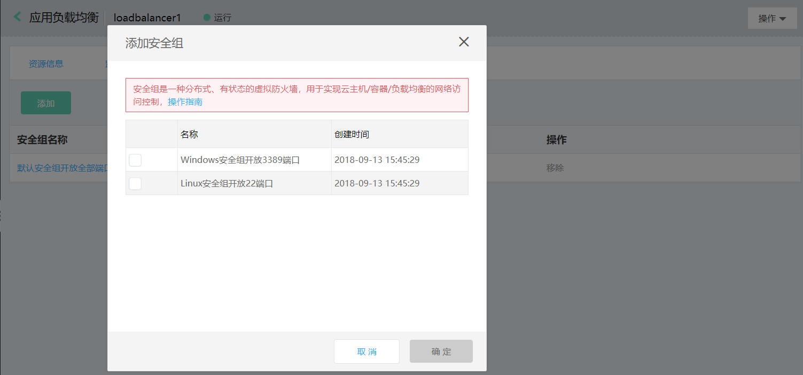
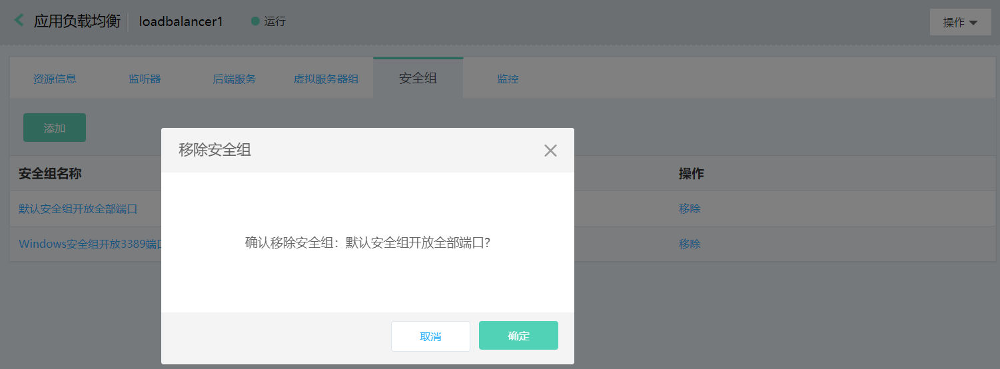
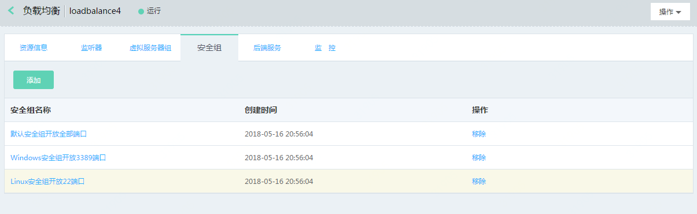

# 安全组管理

## 绑定安全组

1. 通过负载均衡列表页-更多-管理安全组或者详情页-安全组打开安全组页；

1. 安全组列表页，点击 **添加**，为负载均衡绑定安全组，负载均衡只能与同私有网下的安全组绑定，目前一个负载均衡实例最多可绑定4个安全组。

	

## 移除安全组

1. 通过负载均衡列表页-更多-管理安全组或者详情页-安全组打开安全组页；

1. 安全组列表页-操作栏，点击移除可移除对应的安全组；注意：至少保留一个安全组不可删除。

	

## 编辑安全组规则

1. 通过负载均衡列表页-更多-管理安全组或者详情页-安全组打开安全组页；

1. 点击安全组名称进入安全组页面编辑安全组规则

	