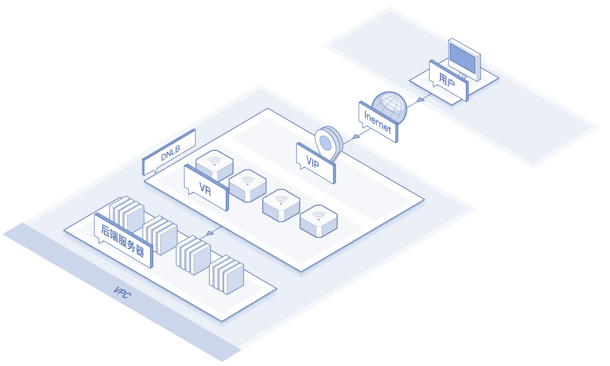
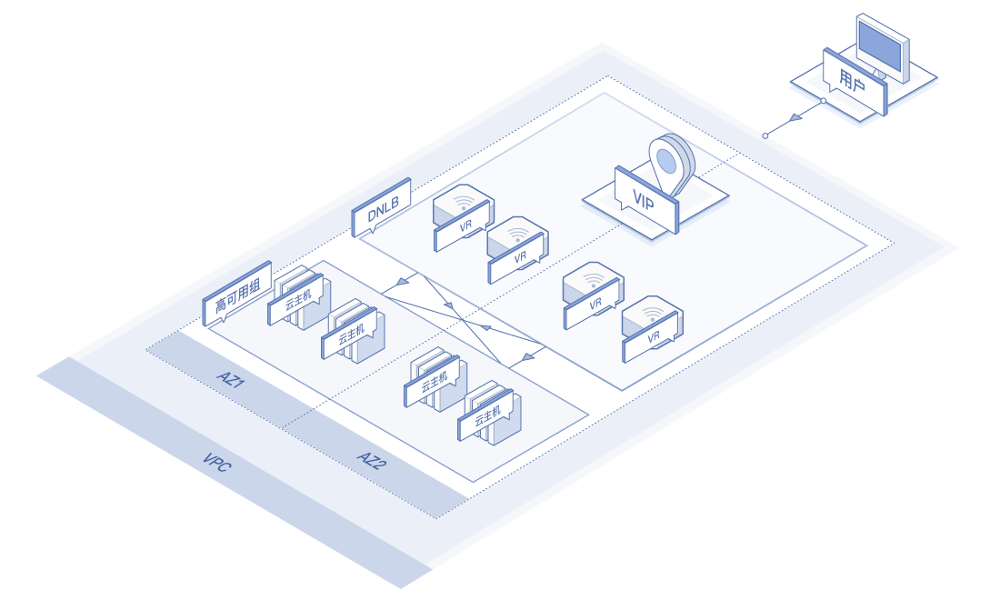
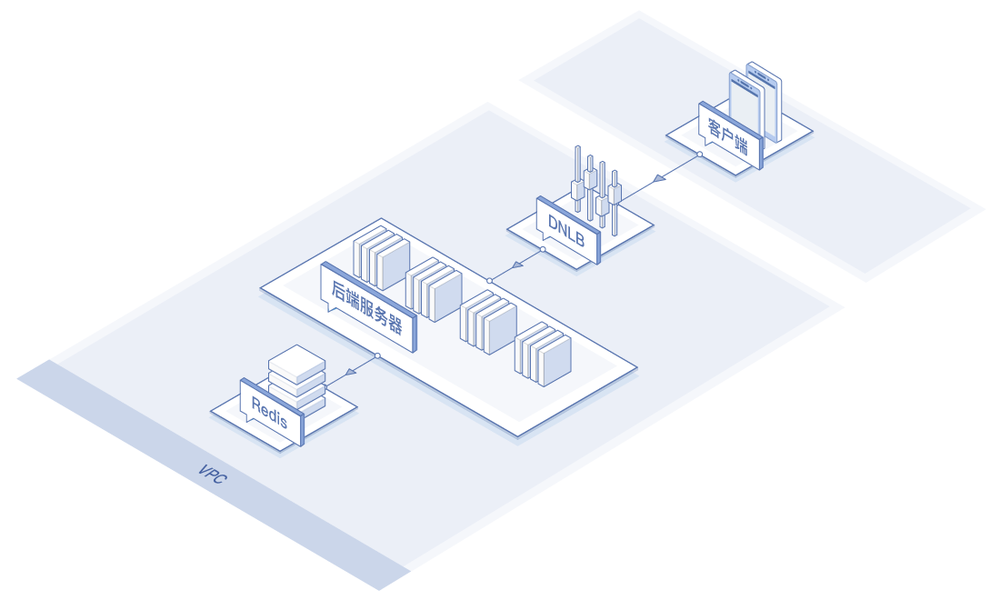
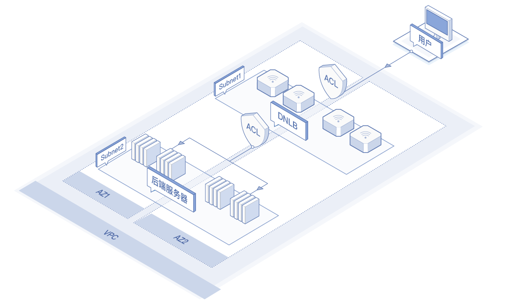

# 应用场景

以下说明分布网络负载均衡的适用场景。

## 超高性能转发无状态业务
分布网络负载均衡采用全可用区分布式部署架构，无负载均衡实体存在，由区域内的网络设备承载负载均衡功能。当业务无状态时，可以支持无性能瓶颈转发，以满足客户高性能、大并发及低时延的需求。对于私网负载均衡，转发瓶颈主要在客户端及后端服务器的带宽；对于外网负载均衡，转发瓶颈主要在公网IP及后端服务器带宽。

## 服务高可用场景
分布网络负载均衡提供多重高可用保障机制，其挂接高可用组部署架构，适用于所有需要提供稳定及高容错能力的业务场景。分布网络负载均衡采用全可用区分布式部署架构，可保证可用区内及跨可用区级的负载均衡服务不中断。分布网络负载均衡绑定高可用组作为后端服务器组，可支持后端服务器按照业务负载情况同机房跨机架及跨可用区的多维度自动弹性伸缩，提高系统的服务能力。

## 负载均衡与会话保持解耦
分布网络负载均衡将负载均衡服务与会话保持解耦，实现更高性能、更灵活的部署。分布网络负载均衡只负责为四层无状态服务提供负载均衡，其将流量分发到后端服务器后，可由后端服务器对接的缓存（例如：Redis、MongoDB等）来保存会话信息，实现会话保持。

## 高安全性场景
分布网络负载均衡提供多重安全防护。分布式网络负载均衡支持通过ACL进行安全访问控制。您可以为分布网络负载均衡单独创建一个子网，基于此子网增加安全策略（黑名单或白名单）来实现防攻击。例如：按照白名单配置时，入方向需要把客户端的源IP和后端服务器IP都加入白名单，出方向可配置为全部放通；按照黑名单配置时，入方向需要把疑似攻击的源IP加入黑名单。同时分布网络负载均衡绑定的公网IP自带抗DDoS攻击能力，提供多重安全保障。

## 相关参考
- [产品优势](../Introduction/Benefits.md)
- [产品功能](../Introduction/Features.md)
- [产品定价](../Pricing/Billing-Overview.md)
- [创建DNLB实例](../Operation-Guide/Create-DNLB-Instance.md)

