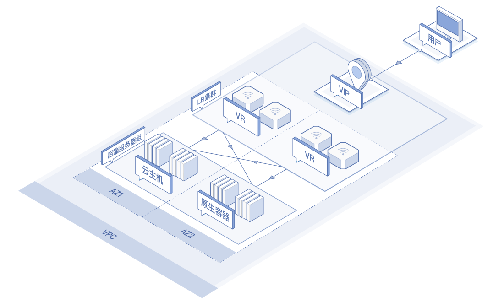

# 产品概述

  
分布网络负载均衡（Distributed Network Load Balancer，简称DNLB）是一款分布式负载均衡产品，可将用户的四层无状态业务请求按照一定策略自主分发给多台后端服务器，从而调整资源利用情况，消除由于单台后端服务器故障对系统的影响，提高系统可用性、扩展系统服务能力。

DNLB采用全可用区分布式部署架构，无负载均衡实体存在，由区域内的网络设备承载负载均衡功能，旨在为用户提供超高性能且长期免费的负载均衡服务，主要面向高性能、大并发、低延时、无需会话保持的四层业务分发场景。

   

DNLB具备以下功能和特点：

* 超高性能：DNLB无负载均衡实体存在，通过区域内的网络设备承载负载均衡功能，不存在由于负载均衡资源性能达到上限而限制转发的情况，转发性能无瓶颈。
* 高可用：DNLB采用全可用区分布式部署，可实现可用区内及跨可用区的负载均衡高可用。
* 自动弹性伸缩：后端服务器可根据业务情况自动调整，免除用户业务规划与手动升级的繁琐。
* 多种后端服务实例：支持云主机和容器作为后端服务实例，为用户业务部署提供更多选择。
* 源IP地址透传：用户源IP地址可直接透传到后端服务器，无需用户做其他操作，便于后端服务器获取或统计源端真实IP信息。
* 长期免费：目前计费策略为长期免费，使用户享受最好性能体验的同时无需考虑负载均衡的成本。

## 分布网络负载均衡&网络负载均衡&应用负载均衡

 比较项 | 分布网络负载均衡| 网络负载均衡 | 应用负载均衡 |
 :-----|  :---- | :---- | :---- |
 性能 	| 转发性能无瓶颈 | 上亿级并发连接、每秒百万级新建连接  | 百万并发连接、每秒万级新建连接 |
服务协议层 |   四层（无状态） |	四层（有状态） | 四层/七层|
协议类型	| TCP |TCP |HTTP、HTTPS、TLS和TCP |
WebSocket支持|——| ——| 	✔ |
服务实例弹性伸缩	| ✔ | ✔ | 	✔ |
多可用区部署 | 全可用区 |	✔ |	✔ |
调度算法	| 加权源IP和加权五元组 | 加权轮询、加权最小连接数和源IP	 | 加权轮询、加权最小连接数和源IP |
后端服务实例类型 |云主机和原生容|	云主和原生容器	| 云主机和原生容器 |
健康检查 | ✔ | ✔ | ✔ |
源IP保留	| 三层报文源IP透传 | 三层报文源IP透传 |	基于HTTP头的X-forward-for机制透传 |
SSL卸载与证书管理 |—— |	—— |	✔ |
空闲连接超时  | —— |	✔	| ✔ |
会话保持	| —— | 基于TCP的会话保持 |	基于Cookie的会话保持 |
连接耗尽超时（取消注册延迟） | —— |	✔	| —— |
高可用组 | ✔ | ✔ | ✔ |
对同一实例上的多个端口进行负载均衡 | —— | ✔	| ✔ |
内外网负载均衡切换	 | ✔ | ✔ |	✔ ||
删除保护 | ✔ | ✔ | ✔ |
计费标准	| 免费 | 费率相对低（公测期间免费）|	费率相对高（公测期间免费）|

## 常用操作

- 创建DNLB实例
  - [创建DNLB实例](../Operation-Guide/Create-DNLB-Instance.md)
  
- 创建虚拟服务器组
  - [创建虚拟服务器组](../Operation-Guide/TargetGroup-Management.md)
	
- 配置监听策略（包括监听器和后端服务）
  - [配置监听策略](../Operation-Guide/Listener-Management.md)
	
- 后端服务管理（包括管理后端服务及查看服务实例健康状态）
  - [后端服务管理](../Operation-Guide/Backend-Management.md)
