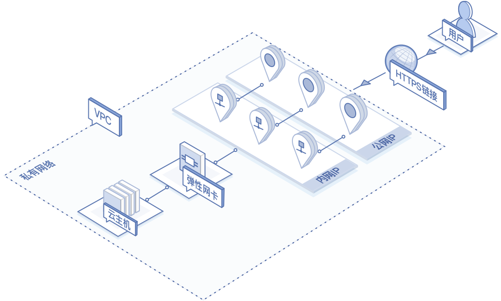

# 云主机承载多个业务

本教程将指导您在同一台云主机上部署多个公网业务，并为每个业务关联一个IP地址。以满足单台云主机承载多业务从而降低成本的需求。本教程主要适用于单台云主机提供多个HTTPS业务，需使用不同的公网IP关联不同证书的场景。

## 业务场景架构

## 开始之前
- 申请一台规格合适的云主机，并配置合适的安全组策略。
- 申请所需数量的弹性公网IP。

## 操作步骤
- 步骤1：登录京东云控制台，进入云主机实例列表页，点击云主机名称进入云主机详情页。

- 步骤2：进入云主机详情页，点击弹性网卡标签页，切换至弹性网卡管理页面。

- 步骤3：选择需要承载业务流量的弹性网卡，进入该弹性网卡IP管理页面。

- 步骤4：在弹性网卡IP管理页面，分配与业务数量匹配的等量内网IP地址。

- 步骤5：在弹性网卡IP管理页面，为每个内网IP地址绑定一个弹性公网IP地址。

- 步骤6：通过SSH登录至云主机，部署相关业务，并为不同的业务流量指定不同的源IP地址。

## 后续测试
- 可以通过访问特定公网IP地址或其对应的域名实现对特定业务的访问。