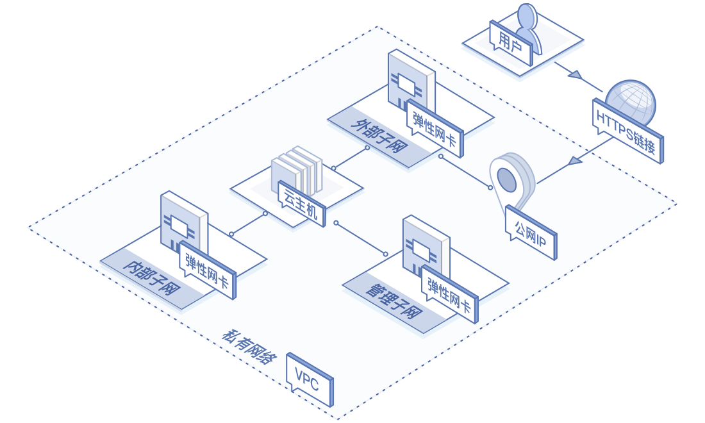
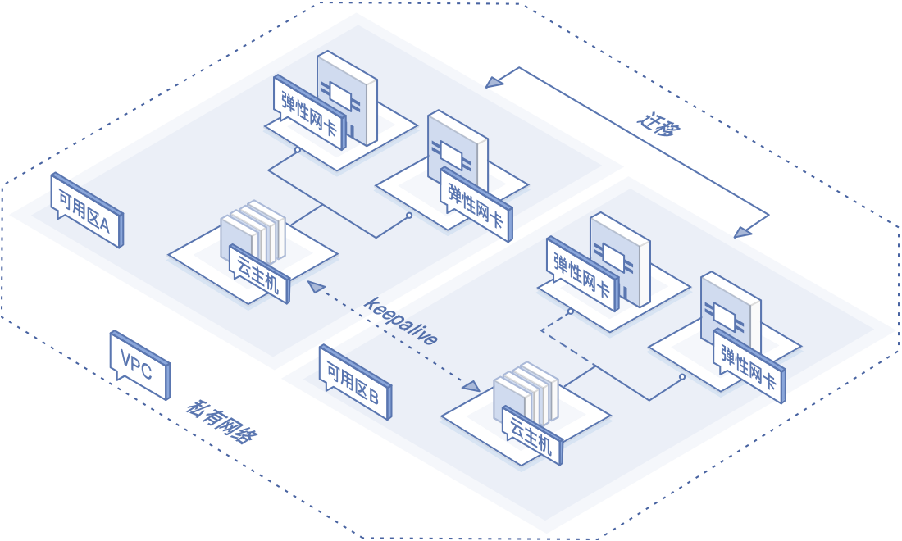

# 应用场景

弹性网卡在构建单主机承载多业务、业务流量分离以及高可用网络等应用场景时可以提供支持，具体使用场景以及说明可以参考下方描述。

## 单台云主机承载多个公网业务
弹性网卡多IP地址特性可以支持构建单台云主机部署多个互联网业务的场景。例如，用户在同一台云主机上提供多个基于HTTPS的Web业务，每个安全证书需要绑定特定IP地址。通过这种部署方式，可以大幅节约用户成本，并提升云主机的资源利用率。场景架构如下：

## 云主机业务流量分离
业务流量分离与网络隔离是弹性网卡最典型的应用场景之一。云主机可以挂载多块分属于同一私有网络内不同子网的弹性网卡，特定网卡分别承载云主机的内网、公网与管理网流量。子网可独立设置访问安全控制策略与路由策略，弹性网卡也可配置独立安全组策略，从而实现了网络隔离与业务流量分离。场景架构如下：

## 高可靠应用解决方案
京东云提供地域级属性弹性网卡，可为用户构建可用区级高可用解决方案提供有力支撑。基于keepalived工具，用户可以实现IP或网卡的故障切换。在特定场景下，用户的弹性网卡与安全设备策略以及安全证书强关联，在发生故障时，需要使用弹性网卡迁移；一般场景下，用户可以使用IP迁移实现故障切换。场景架构如下：

