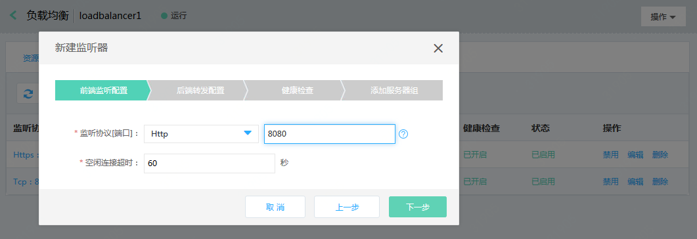
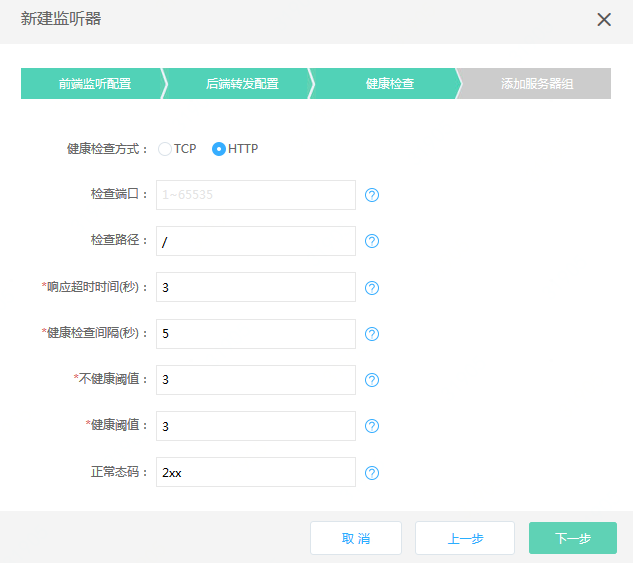

# 使用高可用组作为后端服务器

## 准备与规划

- 网络准备

	根据业务部署需要，提前规划负载均衡和作为后端服务器的云主机、容器的地域、可用区、私有网络等。
	
	注意：作为后端服务器的云主机、容器需要与负载均衡同一地域、私有网络。

- 服务器准备

	需提前创建承载业务流量的云主机、容器，并确保打开监听所需的端口，合理配置安全组、ACL策略。

- 负载均衡实例

	创建一个负载均衡实例，并设置地域、可用区、网络、安全组等配置。

## 创建一个高可用组

- 创建实例模板
   打开控制台，选择 弹性计算>>云主机>>实例模板，设置一系列实例模板所需要的参数，最后点击 **创建** ，生成高可用组所需实例模板
- 创建高可用组
   打开控制台，选择 弹性计算>>高可用组，设置地域、可用区、实例模板等参数，最后点击 **确定** ，创建高可用组

## 创建一个HTTP协议的监听器

- 下面以HTTP监听器为例，说明如何部署高可用组作为后端服务器。
	
	假设已经创建了负载均衡实例、高可用组资源。

	点击 **添加** 创建一个监听器：选择HTTP协议，配置端口、空闲连接超时，点击 **下一步**。
	
	

- 新建一个后端服务，配置名称、协议（默认）、端口、调度算法、开启会话保持、配置获取HTTP头字段，点击 **下一步**。
	
	

- 配置健康检查参数，点击 **下一步**。

	

- 选择服务器类型为高可用组，选择并绑定一个高可用组，点击 **确定**。

	
