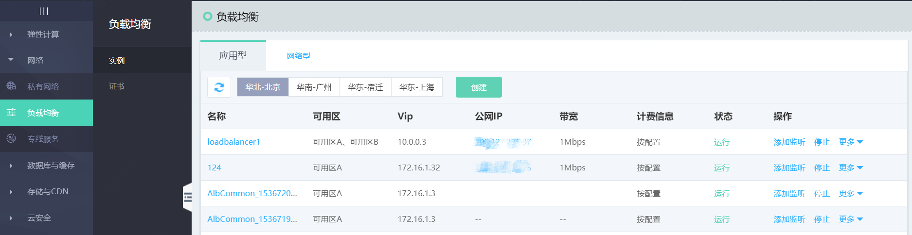
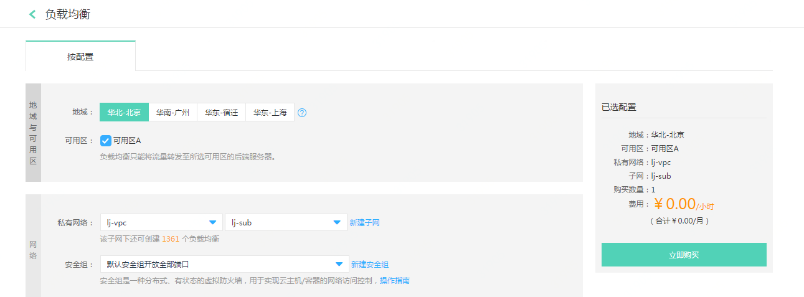
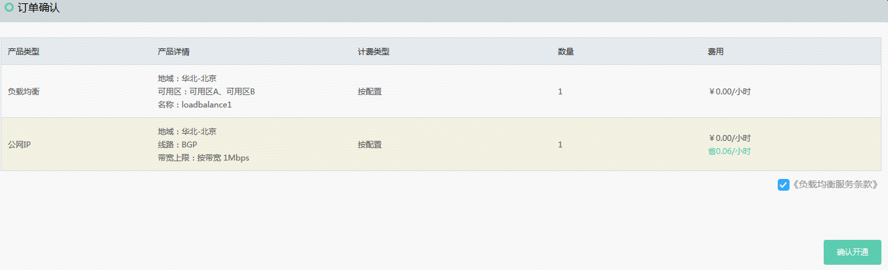
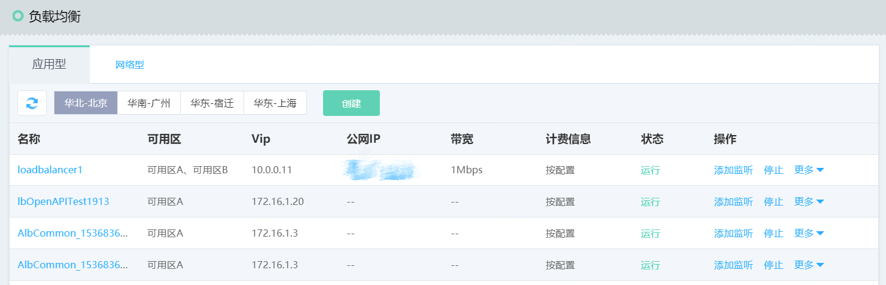
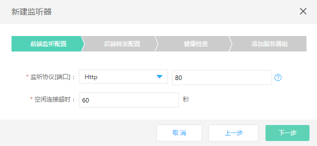
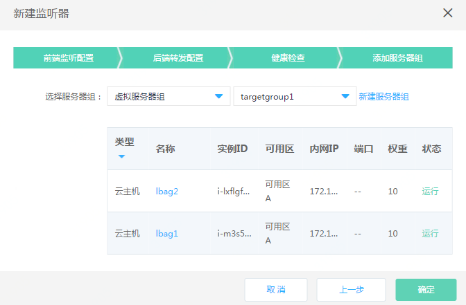
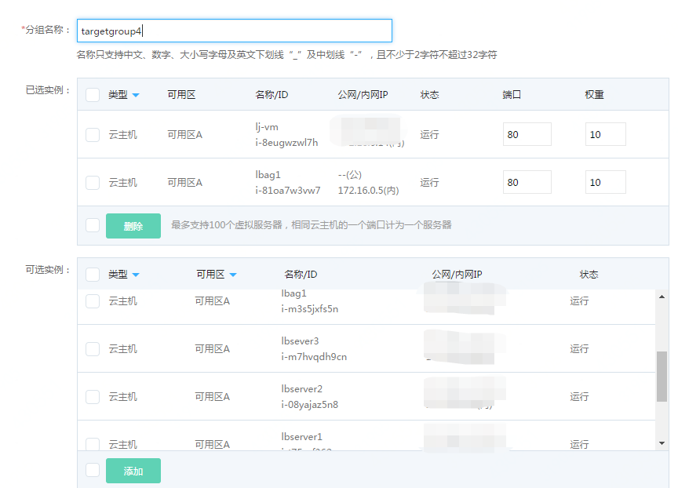

# 创建跨可用区高可用负载均衡

## 准备与规划

- 网络准备

	根据业务部署需要，提前规划负载均衡和作为后端服务器的云主机、容器的地域、可用区、私有网络等。

- 服务器准备

	需提前创建承载业务流量的云主机、容器，并确保打开监听所需的端口，合理配置安全组、ACL策略。

注意：只有创建了负载均衡实例的可用区，才能将可用区下的云主机、容器配置为后端服务。例如，负载均衡在可用区A、可用区B，则可以设置可用区A、可用区B内的云主机、容器进行流量转发。
	
## 创建负载均衡实例

1. 通过控制台菜单-负载均衡打开负载均衡资源列表页，点击 **创建** 新建一个负载均衡实例。

	

1. 选择相应的地域：华北-北京，可用区：可用区A、可用区B。

	

1. 选择私有网络、子网、安全组，绑定公网IP并选择计费方式、带宽。

	

1. 填写负载均衡名称、描述。

	

- 确认配置信息，点击 **立即购买**。

	

- 确认订单信息并完成支付，创建负载均衡实例。

	

- 刷新负载均衡列表，查看新创建的负载均衡实例。

	

- 点击列表右侧 **添加监听** 打开监听器页。

	

- 创建一个HTTP监听器

	点击 **新建监听器** 创建一个监听器。

	前端监听配置：

	1、配置监听协议为HTTP，端口80；

	2、空闲连接超时：设置空闲连接超时时间；

	

- 后端转发配置：

	1、默认后端服务：可以新建后端服务或者选择已有后端服务；

	2、后端服务名称：定义后端服务名称；

	3、后端协议：根据监听协议显示对应的默认协议；

	4、端口：定义后端转发端口；

	5、调度算法：根据业务需要选择，指定为加权轮询；

	6、会话保持：开启； 超时时间：定义cookie的超时时间，使用默认值0，代表与浏览器同生命周期；

	7、获取真实IP：默认开启，此时可通过X-Forwarded-For头字段获取客户端真实IP；

	8、获取HTTP头字段：根据业务需要勾选。

	

- 健康检查：

	选择健康检查方式为：http

	根据业务需要配置相关参数：

	

- 添加服务器组：

	根据业务需要选择虚拟服务器组、高可用组。

	

- 虚拟服务器组添加服务器：

	如没有可用的虚拟服务器组，点击“新建虚拟服务器组”创建一个新的虚拟服务器组，可选云主机、容器，定义实例的端口、权重；

	注：只能选择与负载均衡同可用区和私有网络下的云主机、容器资源。

	

	这样一个跨可用区的负载均衡HTTP监听器配置完成，当单个可用区（如可用区A）发生故障时，负载均衡会将流量转发至可用区B，保证业务正常运行。

	
	​			
	​			
	​			
	​			
