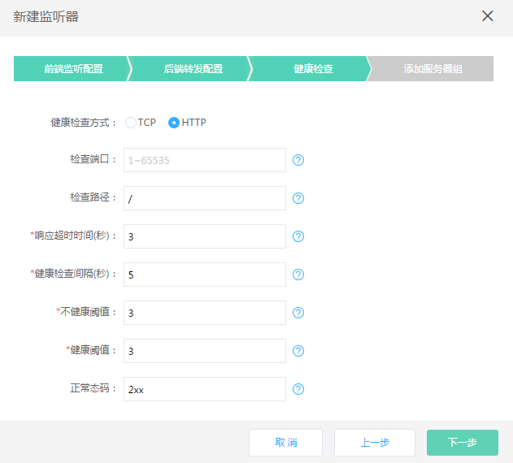
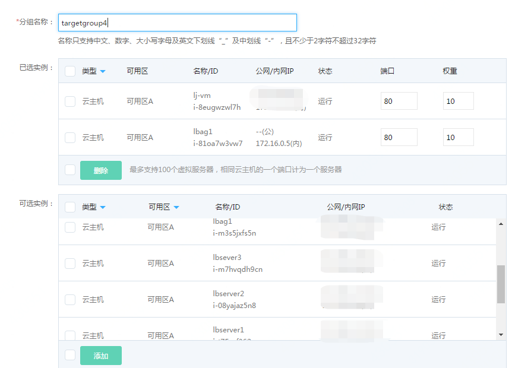
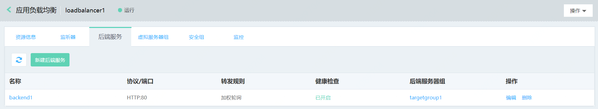
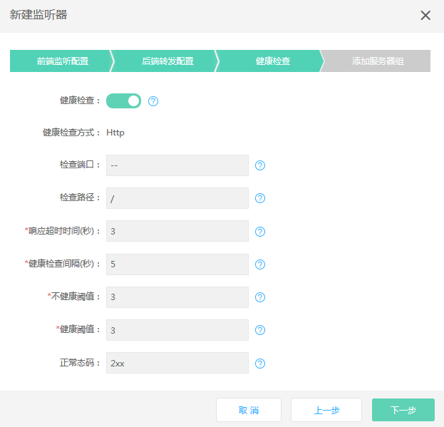
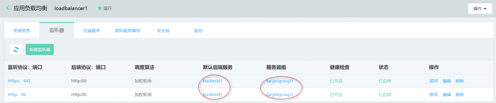

# 快速部署基于相同业务的多个监听器

假如您的业务需要同时支持多个监听器，可以复用后端服务实现快速部署。
例如，您在后端服务部署的网站需要同时HTTP、HTTPS服务，可以创建复用相同后端服务的HTTP、HTTPS监听器。

## 准备与规划

- 网络准备

	根据业务部署需要，提前规划负载均衡和作为后端服务器的云主机、容器的地域、可用区、私有网络等。
	
	注意：作为后端服务器的云主机、容器需要与负载均衡同一地域、私有网络。

- 服务器准备

	需提前创建承载业务流量的云主机、容器，并确保打开监听所需的端口，合理配置安全组、ACL策略。

- 负载均衡实例

	创建一个负载均衡实例，并设置地域、可用区、网络、安全组等配置。

## 创建一个HTTP协议的监听器

- 前端监听配置：
	
	1、配置监听协议为HTTP，端口80；

	2、空闲连接超时：设置空闲连接超时时间；

	

- 后端转发配置：
	
	1、默认后端服务：选择新建后端服务；

	2、后端服务名称：定义后端服务名称，命名为“backend1”；

	3、后端协议：根据监听协议显示对应的默认协议；

	4、端口：定义后端转发端口；

	5、调度算法：根据业务需要选择，这里指定为加权轮询；

	6、会话保持：开启；
	
	7、超时时间：定义cookie的超时时间，使用默认值0，代表与浏览器同生命周期；

	8、获取真实IP：默认开启，此时可通过X-Forwarded-For头字段获取客户端真实IP；

	9、获取HTTP头字段：根据业务需要勾选。

	

- 配置健康检查：选择健康检查方式为：http

	

- 添加服务器组：根据业务需要选择虚拟服务器组、高可用组。

	

- 如没有可用的虚拟服务器组，点击 **新建虚拟服务器组** 创建一个新的虚拟服务器组，可选云主机、容器，定义实例的端口、权重。
	
	注：只能选择与负载均衡同私有网络下的云主机、容器资源。

	

- 至此，已创建完成基于TCP协议的监听器，可在监听器列表查看。

	

- 此时，在后端服务列表中已同步创建了一个名为“backend1”的资源。

	

## 复用后端服务创建HTTPS监听器

- 前端监听配置：

	1、配置前端监听协议为HTTPS，端口为443；

	2、选择加密证书，如没有可用证书可点击“新建证书”上传；

	3、设置空闲连接超时时间；

	

- 后端服务转发：

	选择使用已有后端服务：backend1；
	
	注：直接使用已经存在的backend相关信息，与之前HTTP监听复用同一后端服务配置、健康检查、服务器组。

	

	

	

- 通过这种方式，可以快速创建复用相同后端服务的多个监听器。

	注意：请确认业务场景可以复用后端服务的所有配置，如相同的后端转发端口等。

	
